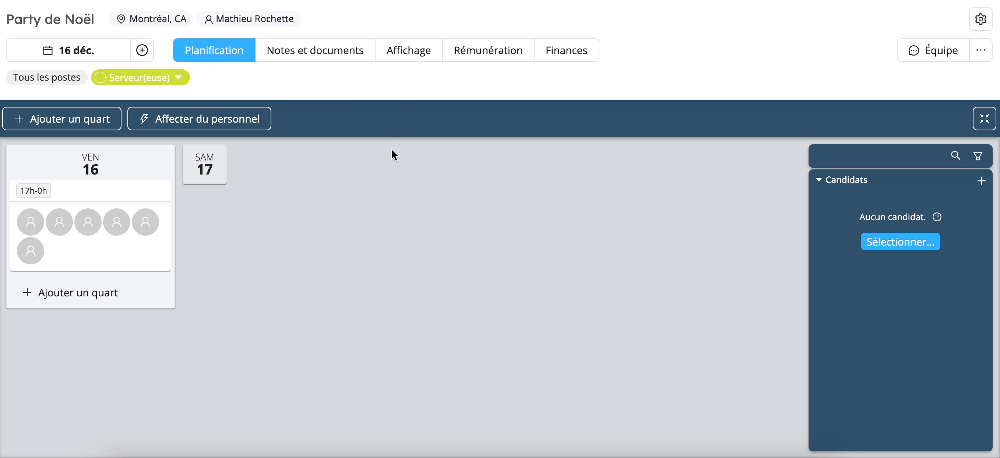

# Gagnez du temps avec la publication d’offres au personnel

Nous le savons, la planification du personnel présente parfois son lot de difficultés. Trouver des candidats disponibles pour des quarts de travail peut s’avérer laborieux. L’utilisation de différents canaux de communication pour contacter les travailleurs afin de connaître leurs disponibilités peut être une véritable perte de temps et il est si facile de ne plus s’y retrouver.

Fini la course contre le temps ! Avec son module de publication d’offres de travail au personnel, Workstaff permet aux gestionnaires de réduire considérablement leur temps de planification grâce à un processus clair et en rassemblant les communications au sein d’une même plateforme.

Cette fonctionnalité permet aussi d’impliquer les membres du personnel davantage dans le processus de planification et de leur offrir la possibilité d’avoir une certaine prise et une flexibilité dans le choix de leurs heures de travail. Les travailleurs peuvent consulter et appliquer à des offres depuis leurs téléphones portables en quelques secondes.

## Comment ça fonctionne ?

Le module de publication d’offres de travail utilise les données correspondantes entre votre projet et les compétences et la localisation des membres de votre personnel.

Une fois votre projet et vos quarts de travail créés, vous n’avez qu’à vous rendre dans l’onglet affichage pour accéder aux différentes options d’affichage. Vous pouvez choisir d’afficher l’offre à tous les employés ayant la compétence correspondant au poste du quart que vous souhaitez pourvoir. Workstaff vous donne aussi la possibilité de publier cette offre à des personnes spécifiques que vous pouvez sélectionner dans votre liste de personnel complète.

Grâce aux notes au personnel, ajouter tout détail supplémentaire concernant votre offre se fait haut la main et vous permet de rassembler les informations au même endroit.

Une fois l’offre publiée, elle est immédiatement visible par toutes les personnes concernées et elles peuvent y appliquer en quelques secondes du bout de leurs doigts grâce à l’appli mobile Workstaff.

Une fois les candidatures reçues, elles sont mises en évidence afin que vous puissiez les traiter rapidement et pourvoir les postes vacants en quelques clics.

## À vous de jouer !
Publiez facilement des offres de postes à votre personnel en vous rendant dans l’onglet **Affichage** de la page de votre projet. Choisissez le poste à afficher et les personnes pour qui cette offre sera visible. Et le tour est joué !

Pour en savoir plus, consultez notre [**Centre d’aide**](https://help.workstaff.app/fr/docs/managers/scheduling/publish/) pour obtenir plus de détails sur l’affichage des offres de travail sur Workstaff. 

