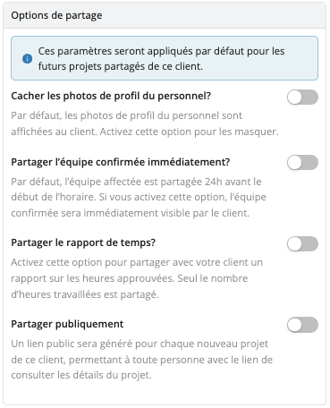

# Portail Client

Le Portail Client offre à vos clients un tableau de bord en ligne facile à utiliser, leur permettant de consulter leurs projets, de soumettre des demandes de personnel et de suivre les progrès en temps réel.

Contactez notre équipe [Customer Success](mailto:customer.success@workstaff.app) pour activer l'extension **Portail Client** pour votre compte Workstaff.

## Activer l'accès pour un client

1. Naviguez dans la section **Clients** et cliquez sur le nom du client pour lequel vous souhaitez activer le portail.
2. Sous **Portail**, cliquez sur **Activer l'accès pour ce client**.

Un lien unique sera généré pour ce client, lui permettant de s'inscrire et de se connecter à votre organisation.
Une fois que le client se connecte pour la première fois, le statut du portail passe automatiquement de **Invité** à **Actif**.

:::note
Cliquez sur **Envoyer le lien par courriel** pour générer un modèle de courriel que vous pourrez envoyer à votre client pour l'inviter à s'inscrire.
:::

## Gestion des mandats

Lorsqu'un client soumet une nouvelle demande de mandat, une notification par courriel est envoyée et la demande apparaît dans la section **Mandats** sous la liste **Mandats à réviser**. Cliquez sur **Consulter** pour vérifier les informations fournies par le client, puis choisissez d'**Accepter** ou de **Refuser** le mandat. Si le mandat est accepté, un projet sera automatiquement créé pour son exécution.

## Partager des informations avec un client

### Partager un projet

Pour partager un projet avec un client qui n'est pas lié à un mandat :
1. Tout d'abord, assurez-vous que le client est associé au projet. Cette opération peut être effectuée lors de la création du projet ou ultérieurement dans les paramètres du projet.
2. Ensuite, allez dans les paramètres du projet, naviguez vers **Portail**, et cliquez sur **Partager avec le client**.

### Mise à jour des options de partage

Les options de partage suivantes sont disponibles :
- **Partage des photos de profil du personnel**
- **Partage de l'équipe confirmée immédiatement**
- **Partage du rapport de temps**
- **Partager publiquement**

Vous pouvez configurer ces options directement au niveau du client, et elles seront appliquées par défaut à tous les futurs projets partagés avec ce client. Il est également possible d’ajuster les paramètres de partage pour un projet spécifique afin de les adapter à vos besoins.

## Gestion de l'accès au portail

Si vous devez modifier ou révoquer un accès au portail, veuillez [nous contacter](mailto:support@workstaff.app) pour obtenir de l'aide.