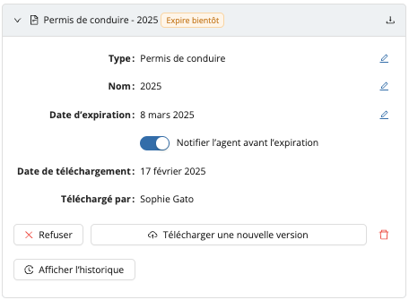

# Documents

## Simplifiez la gestion de votre personnel avec les Documents

La fonctionnalité Documents facilite la collecte, l'organisation et la gestion des documents essentiels pour votre personnel. Voici pourquoi c'est un atout incontournable :

- **Conformité et organisation sans effort** : Demandez et suivez les documents requis en toute simplicité, garantissant que votre équipe reste conforme et à jour.
- **Notifications claires** : Lorsqu’un document est demandé ou approche de sa date d’expiration, le personnel recevra une notification.
- **Flux d'approbation** : Examinez facilement les soumissions—approuvez, rejetez ou demandez une nouvelle version—le tout depuis un emplacement centralisé.

Activez l'extension Documents dès aujourd'hui pour garder votre équipe organisée et vos opérations fluides.

:::info
Consultez notre [Matrice des fonctionnalités](../features-matrix.md) pour vérifier si cette fonctionnalité est incluse dans votre plan. Pour toute question, n’hésitez pas à contacter notre équipe [Customer Success](mailto:customer.success@workstaff.app).
:::

## Commencer en 3 étapes simples

### 1. Création d’un type de document

Dans le menu **Paramètres**, cliquez sur **Documents**, puis créez un nouveau type en cliquant sur **+ Ajouter un type**. Saisissez un nom et cliquez sur **Enregistrer**.

Une fois créé, ce type de document pourra être sélectionné pour l’ajout de documents aux profils du personnel.

### 2. Demande de documents au personnel

Dans le profil d’un membre du personnel, accédez à l’onglet **Documents**. Vous pouvez **Demander un document** ou directement **Télécharger un document**.

Lorsqu’un document est demandé, le personnel sera invité à le téléverser. Il apparaîtra dans sa liste de tâches sous l’onglet Aujourd’hui. Une fois le document soumis par le personnel, il apparaîtra dans le profil du personnel comme **En attente d’approbation** et vous pourrez :
- **Approuver** le document.
- **Refuser** le document.
- **Télécharger une nouvelle version** de ce document.

:::info
Le personnel recevra des notifications lorsqu’un document est demandé et lorsqu’il approche de son expiration (jusqu’à 30 jours avant l'expiration), les invitant à en télécharger une version mise à jour.
:::

### 3. Gestion des documents

Accédez à l’onglet **Documents** pour gérer les documents de votre personnel. Vous y trouverez un aperçu de :
- **À réviser** : Documents téléchargés par le personnel.
- **Expirés** : Documents dont la date d’expiration est dépassée.
- **Expirant bientôt** : Documents dont la date d’expiration est dans les 30 prochains jours.
- **Demandes en attente** : Documents demandés au personnel mais non encore téléchargés.