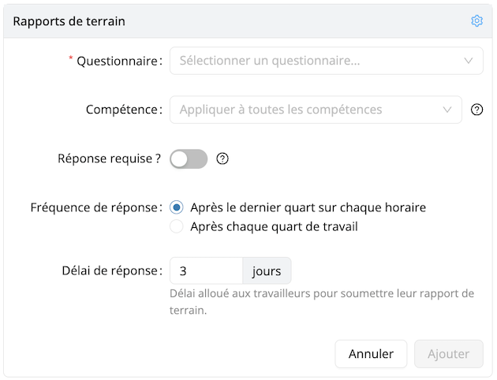

# Rapports de terrain

## Optimisez votre gestion avec les Rapports de terrain

Les Rapports de terrain vous permettent de collecter des retours structurés de votre personnel, offrant une meilleure visibilité et facilitant la prise de décision. Voici pourquoi ils sont indispensables :
- **Standardisez la collecte de données** : Obtenez des informations cohérentes et exploitables grâce à des questionnaires personnalisables.
- **Améliorez le suivi et la conformité** : Assurez-vous que les rapports sont complétés à temps grâce à des attributions et des échéances automatisées.
- **Intégration fluide** : Associez facilement les rapports aux projets et aux clients pour une gestion simplifiée.

Activez l’add-on Rapports de terrain dès aujourd’hui et prenez le contrôle de vos informations opérationnelles.

## Commencer en 3 étapes simples

### 1. Ajout de l’extension Rapports de terrain

Dans la section Paramètres, ouvrez le menu **Ajouts** et cliquez sur **Activer** sous **Rapports de terrain**.

:::info
Consultez notre [Matrice des fonctionnalités](../features-matrix.md) pour vérifier si cette fonctionnalité est incluse dans votre plan. Pour toute question, n’hésitez pas à contacter notre équipe [Customer Success](mailto:customer.success@workstaff.app).
:::

### 2. Création d'un questionnaire

Dans le menu **Paramètres**, cliquez sur **Questionnaires**, puis créez un nouveau questionnaire en cliquant sur **+ Créer un questionnaire**. Ajoutez un titre et cliquez sur **+ Ajouter une question**. Vous devrez ensuite renseigner les informations suivantes avant d’ajouter la question :
- **Nom** : Un nom court et informatif pour un usage interne.
- **Type** : Choisissez parmi Texte ouvert, Nombre, Choix multiple, Choix unique ou Échelle d’évaluation.
- **Optionnel** : Indiquez si la question est facultative.
- **Question** : La question qui sera partagée avec le personnel.
- **Texte d’aide** : Informations supplémentaires pour aider le personnel à mieux comprendre la question.
- **Informations complémentaires** : Requises pour les champs de type Choix multiple, Choix unique et Échelle d’évaluation.

Une fois complété, le questionnaire pourra être sélectionné dans n’importe quel projet.

:::note
Un questionnaire peut également être attribué par défaut à un client. Pour chaque projet créé pour ce client, le questionnaire sera automatiquement lié et votre personnel devra toujours soumettre des rapports de terrain. Consultez notre [Matrice des fonctionnalités](../features-matrix.md) pour vérifier si cette fonctionnalité est incluse dans votre plan.
:::

### 3. Collecte des Rapports de terrain auprès du personnel

#### Assigner un questionnaire à un projet :

1. Rendez-vous sur la page de votre projet.
2. Cliquez sur **Paramètres**.
3. Sous **Rapports de terrain**, cliquez sur **+ Ajouter un questionnaire**.
4. Sélectionnez un questionnaire.
5. Choisissez s’il doit être appliqué à une compétence spécifique.
6. Définissez si la réponse est requise, précisez la fréquence, le délai de réponse, puis cliquez sur **Ajouter**.

Une icône bleue de rapport apparaîtra sous le nom du membre du personnel, indiquant qu’un rapport de terrain lui a été demandé. Le message « Un rapport de terrain a été demandé automatiquement à partir des paramètres du projet » s’affichera.

#### Assigner un questionnaire à une affectation spécifique :

1. Rendez-vous sur la page de votre projet.
2. Sélectionnez une ou plusieurs affectations.
3. Cliquez sur **Rapports de terrain** puis **Demander**.
4. Sélectionnez un questionnaire.
5. Définissez si la réponse est requise, le délai de réponse, puis cliquez sur **Demander**.

Une icône orange de rapport apparaîtra sous le nom du membre du personnel, indiquant qu’un rapport de terrain lui a été demandé. Le message « Un rapport de terrain a été demandé manuellement » s’affichera.

#### Gérer les réponses aux Rapports de terrain :

Lorsque la réponse est requise, le personnel sera invité à remplir le rapport terrain immédiatement après avoir soumis son temps dans l’application mobile. Il apparaîtra également dans leur liste de tâches sous l’onglet Aujourd’hui.

Pour avoir une vue d’ensemble des rapports soumis et en attente, accédez à l’onglet **Rapports de terrain** sur la page du projet. Cliquez sur **Voir les détails** pour afficher les réponses reçues.

:::note
Si l’add-on **Portail Client** est inclus dans votre abonnement, vous pouvez partager les réponses directement avec votre client en cochant **Partagé avec le client**.
:::

:::info
Téléchargez un fichier Excel contenant tous les Rapports de terrain d’un projet en cliquant sur **Télécharger les réponses** en haut à droite du tableau.
:::