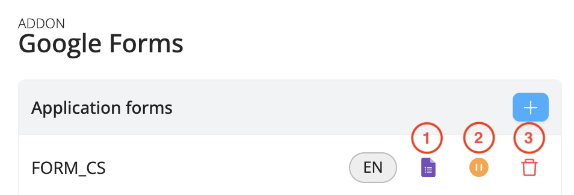
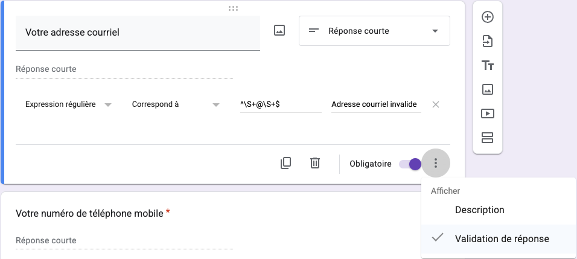
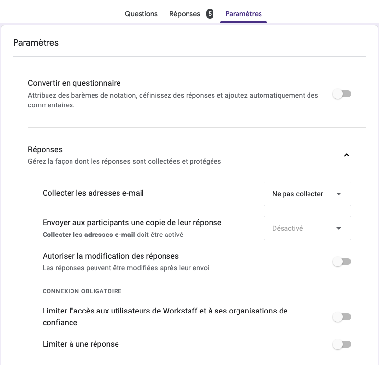

# Intégration avec Google Forms

Simplifiez vos processus de candidature et de recrutement grâce à l'extension Google Forms de Workstaff. Collectez facilement les informations essentielles des candidats et créez automatiquement leurs profils à partir de leurs réponses, gagnant ainsi du temps et optimisant votre workflow pour une expérience plus fluide.

## Mise en route

1.	Dans la section Paramètres,  ouvrez le menu **Ajouts** et cliquez sur **Activer** sous **Google Forms**.
2.	Une fenêtre Google s’ouvrira, vous demandant de saisir vos identifiants Google afin de connecter les deux applications.
3.	Cliquez sur **Configurer**, puis créez votre formulaire de candidature en cliquant sur le bouton **+**. Sélectionnez un titre et une langue pour le formulaire.
4.	Choisissez les **champs personnalisés à inclure** dans le formulaire. Les réponses saisies dans ces champs par les candidats mettront automatiquement à jour leur profil dans Workstaff.

:::note
Nous vous recommandons de **[créer des champs personnalisés](../staff/organizing.md#champs-personnalisés)** au préalable afin de pouvoir les sélectionner dans votre formulaire Google.
:::

Workstaff crée un formulaire dans votre compte Google Forms, collectant le prénom, nom, adresse email et les champs supplémentaires choisis. Vous pouvez ensuite le personnaliser selon vos besoins : ajouter des images, réorganiser les questions ou en ajouter de nouvelles. Lorsqu'un candidat soumet un formulaire Google, Workstaff crée un profil candidat, garantissant que ses informations sont prêtes pour l'intégration.

## Gestion des formulaires

1. **Accéder au formulaire Google**, puis cliquez sur le crayon dans le coin inférieur droit pour le modifier. 
2. **Mettre le formulaire sur pause** : Cette action empêche les candidats de soumettre leurs réponses. Vous pouvez réactiver le formulaire Google en cliquant sur le bouton vert.
3. **Supprimer le formulaire** : Si nécessaire, vous pouvez choisir de supprimer entièrement le formulaire.

:::note
Saisissez une adresse électronique sous **Notifications par courriel** pour recevoir des alertes en cas de réussite ou d'échec de la soumission.
:::

## Paramètres Google Forms

### Modifications des questions

Les informations saisies par les candidats dans des questions ajoutées directement sur le formulaire Google (en dehors de Workstaff) ne seront pas synchronisées avec leur profil Workstaff.  Cependant, vous pourrez les consulter dans l’onglet **Réponses** du formulaire Google ou dans un Google Sheet associé en cliquant sur **Lien vers Sheets**. 

**Conseil de pro :** Configurez une validation des réponses pour garantir que les candidats fournissent les bonnes informations. Par exemple, pour s’assurer qu’ils entrent une adresse courriel plutôt qu’une adresse postale, utilisez une expression régulière comme ^\S+@\S+$ dans le champ correspondant.

### Partage du lien aux candidats

Avant de partager le lien du formulaire Google avec les candidats, assurez-vous que les **Paramètres** sont correctement configurés. Pour permettre à tous d’accéder au formulaire, vérifiez que l’option **Restreindre aux utilisateurs de votre organisation et de ses organisations de confiance** est décochée.

Pour générer un lien partageable, cliquez sur **Envoyer** dans le coin supérieur droit du formulaire, puis sélectionnez **Envoyer par lien**. Vous pouvez raccourcir l'URL si nécessaire, puis cliquer sur **Copier**. Le lien peut ensuite être partagé sur votre site web, vos réseaux sociaux ou via tout autre canal de votre choix.

:::info
Consultez notre [Matrice des fonctionnalités](../features-matrix.md) pour vérifier si cette fonctionnalité est incluse dans votre plan. Pour toute question, n’hésitez pas à contacter notre équipe [Customer Success](mailto:customer.success@workstaff.app).
:::