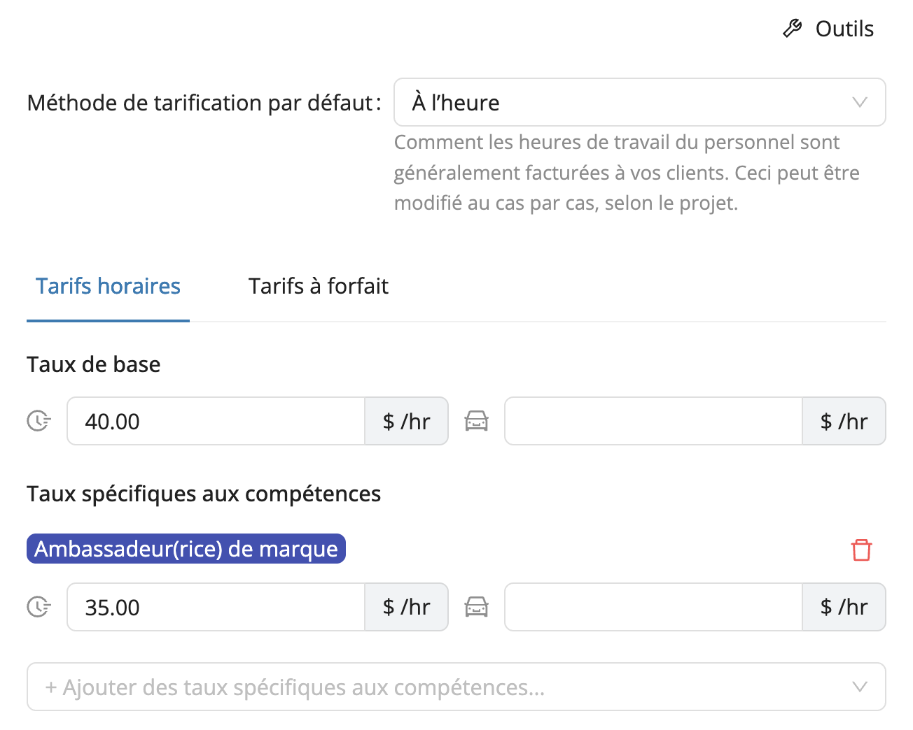

# Tarification client

Gérer la facturation de vos clients pour chaque projet peut rapidement devenir complexe, surtout lorsque vous jonglez avec plusieurs événements, compétences et structures de tarifs.  
La fonctionnalité **Tarification client** de Workstaff vous aide à garder une vision d’ensemble sur vos tarifs de facturation directement dans vos projets, afin de mieux **budgéter, suivre et analyser** la performance financière de vos événements.

Avec la Tarification client, vous pouvez :
- Définir des tarifs de facturation pour vos clients et projets.  
- Voir le **budget planifié** dans l’onglet **Finances** de vos projets.  
- Comparer les heures **facturées vs payées** côte à côte avec les données de rémunération du personnel.  

## Définir les tarifs

Vous pouvez définir vos tarifs de manière globale ou par compétence, tout en ayant la possibilité de les ajuster au besoin, jusqu’au niveau d’un projet :
- **Niveau entreprise** (tarif par défaut de votre organisation)  
- **Niveau client** (tarification spécifique à un client)  
- **Niveau projet** (tarification personnalisée pour un projet en particulier)  

Lors de la configuration de votre facturation, vous pouvez choisir entre différents **modes de facturation**, selon la manière dont vous facturez vos clients :
- **À l’heure** : un tarif fixe par heure travaillée ou de déplacement. 
- **À forfait** : un montant fixe par quart de travail.

## Suivre et analyser les montants facturables

Dans l’onglet **Finances** de chaque projet, vous pouvez consulter le **montant facturable** à côté des données de rémunération du personnel. Cela vous permet d’avoir une vue d’ensemble sur vos **coûts** (paie du personnel) et vos **revenus** (facturation client) au même endroit.

Dans la section **Rapports**, un nouveau rapport **Tarification client** vous offre une vue consolidée de vos projets, clients pour une période spécifique.  
Vous pouvez facilement **exporter ces données vers Excel** pour une analyse ou un suivi financier plus approfondi.

Si vous avez des questions ou des commentaires sur le fonctionnement de la Tarification client ou sur la meilleure façon de la configurer pour votre organisation, notre équipe de soutien se fera un plaisir de vous aider.  
Contactez-nous via le chat ou par courriel à **support@workstaff.com**.