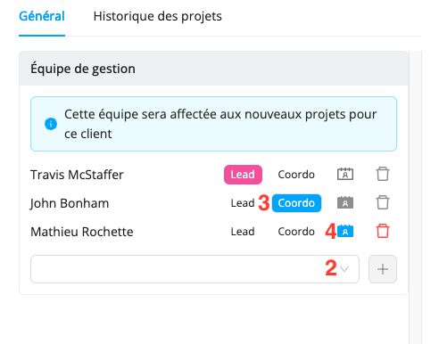

# Gérez votre liste de clients

La section **Clients** a été créée pour vous aider à suivre et à gérer vos clients de manière efficace. En utilisant cette section, Workstaff vous permettra de consulter rapidement votre liste de clients et de créer des profils clients. Ces profils peuvent être ensuite associés à vos projets pour vous aider à mieux organiser votre calendrier.
Lorsqu'un client est associé à un projet, son nom apparaîtra sur la page du projet et sur votre calendrier. De plus, vous pourrez consulter l'historique de vos projets pour chaque client enregistré.

:::info
Consultez notre [Matrice des fonctionnalités](../features-matrix.md) pour vérifier si cette fonctionnalité est incluse dans votre plan. Pour toute question, n’hésitez pas à contacter notre équipe [Customer Success](mailto:customer.success@workstaff.app).
:::

## Ajouter un nouveau client
Dans le menu principal, allez dans la section **Clients**.
- Cliquez sur **Ajouter un client**
- Inscrivez le nom de la compagnie
- Cliquez sur **Créer**

## Importer une liste de clients

Vous avez besoin de créer plusieurs clients en une seule fois ? Notre outil d’import en masse rend cela simple et rapide.
Téléchargez un [exemple de fichier](https://employer.workstaff.app/en/assets/import-templates/client-import.csv) pour commencer, puis remplissez-le en suivant les règles d’import ci-dessous :

| **Champ** | **Obligatoire ?** | **Notes**         |
|-----------|-------------------|-------------------|
| Name      | Oui               | Nom du client     |
| Code      | Non               | Code client       |
| Address   | Non               | Adresse du client |

Une fois votre fichier prêt, vous pouvez l’importer depuis l’onglet **Client**, en cliquant sur les **trois petits points** à droite du bouton **Ajouter un client**, puis en sélectionnant **Importer**.

Le système détectera automatiquement les éventuelles erreurs et les affichera **avant la finalisation**. Vous pourrez alors les corriger, puis relancer l’import.

Une fois l’import complété à 100 %, vos clients seront créés !

## Général

### Informations de base
Une fois que vous avez ajouté un client à votre liste, vous pouvez afficher son profil en cliquant sur son nom.
Sous **Informations de base**, vous pouvez modifier son nom et ajouter son adresse.

### Équipe de gestion
Lorsque vous associez une équipe de gestion à un client, elle sera automatiquement affectée à tous les projets que vous créez pour ce client.

:::info  
Par défaut, la première personne affectée au client se voit attribuer les rôles de **Lead** et **Coordonnateur**. Le **Coordonnateur** est systématiquement le contact principal pour les projets du client, tandis que vous pouvez décider si le **Lead** est, ou non, une personne contact pour le personnel. Vous avez aussi la possibilité de choisir si les prochaines personnes que vous ajoutez à l’équipe de gestion sont des personnes contact pour le personnel ou non. Toutes les personnes contact seront incluses dans les conversations d’équipe.
:::

**Pour affecter une équipe de gestion à un client :**

1. Vous pouvez afficher la fiche du client en tapant son nom dans la barre de recherche ou en cliquant sur son nom sur la page du projet. 
2. Sous **Équipe de gestion**, cliquez sur la case vide et sélectionnez la prochaine personne que vous souhaitez ajouter à l’équipe, puis cliquez sur **+**.
3. Sélectionnez le rôle de la personne (Lead, Coordo, ou aucun).
4. Si elle n’est pas **Coordonnateur**, déterminez si elle est une **Personne contact pour le personnel** en sélectionnant l’icône indiquée dans la capture d’écran ci-dessus.
5. Une fois l’équipe de gestion composée, cliquez sur **Sauvegarder**.

## Archiver/supprimer un client
Vous pouvez archiver un client en cliquant sur **Archiver** à côté de son nom dans la liste des clients.
Lorsque vous archivez un client, il sera retiré de votre liste de clients actifs et sera placé dans l'onglet **Archivés**. Vous pourrez toujours accéder aux informations et à l'historique de projets associés à ce client et, si besoin, vous pourrez choisir de le **désarchiver**.

Vous pouvez également supprimer définitivement un client de votre liste en cliquant sur **Supprimer**.

:::note
Vous ne pouvez supprimer un client que s'il n'est rattaché à aucun projet.
:::