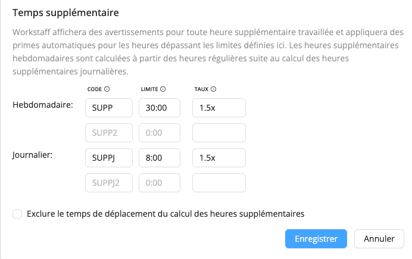

# Configurer les heures supplémentaires

Workstaff peut calculer [et rémunérer](../payroll/overtime.md) les heures supplémentaires automatiquement, à la fois quotidiennement et hebdomadairement. Lorsque les règles relatives aux heures supplémentaires sont configurées dans votre compte, Workstaff affiche des avertissements aux endroits appropriés, tels que l'affichage du calendrier hebdomadaire ou lors de la réservation du personnel. Ces avertissements sont conçus pour mettre en évidence les situations dans lesquelles des heures supplémentaires non désirées seraient introduites par la réservation d'un certain personnel.

## Options relatives aux heures supplémentaires

Pour personnaliser la façon dont Workstaff calcule les heures supplémentaires pour les heures travaillées par votre équipe, allez dans **Settings / Account** (Paramètres / Compte) et descendez jusqu'au panneau **Remuneration** (Rémunération).

Les limites que vous configurez ici détermineront quand un employé commence à faire des heures supplémentaires, et combien il doit être payé en supplément pour les heures supplémentaires qu'il a effectuées. Vous pouvez configurer jusqu'à 2 règles quotidiennes et 2 règles hebdomadaires.

### Prise en compte du temps de déplacement

Par défaut, le calcul des heures supplémentaires inclut le temps de déplacement, ce qui signifie qu'un quart de travail de 8 heures avec 1 heure de déplacement comptera pour un total de 9 heures dans les calculs des heures supplémentaires. Vous pouvez éventuellement désactiver ce comportement en cochant l'option **Exclure le temps de déplacement du calcul des heures supplémentaires**.