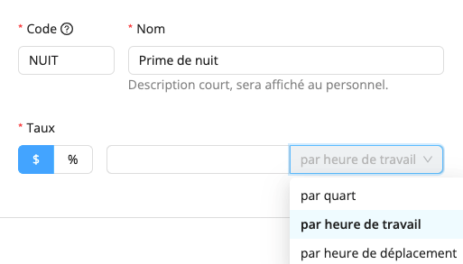
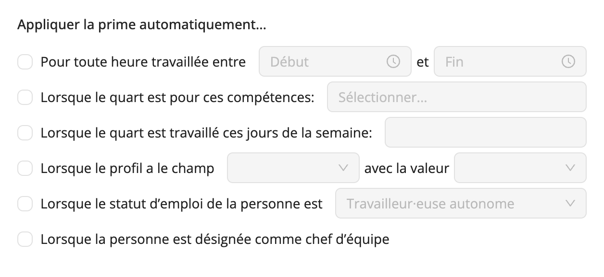

# Créez vos propres primes

Workstaff vous permet de créer vos propres primes que vous pourrez ensuite ajouter aux conditions de rémunération de vos projets si nécessaire.

<iframe width="640" height="307" src="https://www.loom.com/embed/f94e6a266ac043e0b325d9bba2edf734" frameborder="0" webkitallowfullscreen mozallowfullscreen allowfullscreen></iframe>

## Créer des primes
La création de vos propres primes est une tâche simple et rapide. Une fois créées, vos primes seront disponibles lorsque vous modifierez les conditions de rémunération de vos projets.
1. Allez dans la section **Paramètres** du menu principal
2. Allez dans la section **Primes**
3. Cliquez sur **Ajouter**
4. Remplissez les champs et choisissez si le taux est monétaire ou un pourcentage du salaire de base.

## Primes automatisées 
Lors de la création d'une nouvelle prime, vous pouvez choisir de l'appliquer automatiquement aux quarts de travail lorsqu'une ou plusieurs des conditions suivantes sont remplies :

- **Pour toute heure travaillée entre “Début” et “Fin”**: La prime s'appliquera à toutes les heures travaillées entre l'heure de début et l'heure de fin que vous avez sélectionnées;
- **Lorsque le quart est pour ces compétences**: Chaque fois qu'un travailleur est affecté à l'une des compétences sélectionnées, la prime est appliquée aux conditions de rémunération de son affectation;
- **Lorsque le quart est travaillé ces jours de la semaine**: La prime est appliquée aux quarts qui ont lieu les jours sélectionnés;
- **Lorsque le profil a le champ "..." avec la valeur "..."**: La prime est automatiquement appliquée à tous les travailleurs affectés ayant le champ personnalisé et la valeur sélectionnés dans leur profil;
- **Lorsque le statut d'emploi de la personne est "..."**: La prime est automatiquement appliquée à tous les employés inscrits ayant le statut d'emploi sélectionné dans leur profil;
- **Lorsque la personne est désignée comme chef d'équipe**: La prime est automatiquement appliquée à tous les chefs d'équipe désignés pour le projet.

