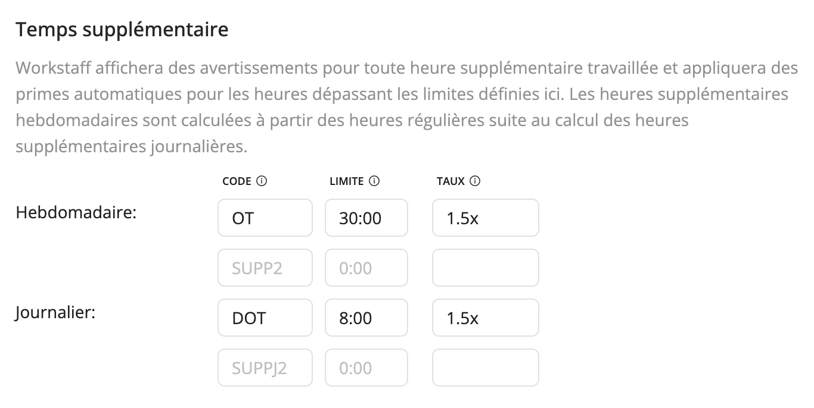

# Paramètres de la rémunération

Workstaff allows you to customize the way your remuneration is calculated for your account. To do so, head to the **Account** tab of the **Settings** section, and scroll down to **Remuneration**.

Once you input values in the chosen options, they will automatically be applied to shifts when the specified conditions are fulfilled.

## Temps supplémentaire 
L'outil de calcul des heures supplémentaires de Workstaff permet de rémunérer correctement les membres du personnel qui travaillent au-delà de leurs heures normales de travail.

Vous pouvez définir jusqu'à deux options de calcul des heures supplémentaires **hebdomadaires** et **journalières**.

