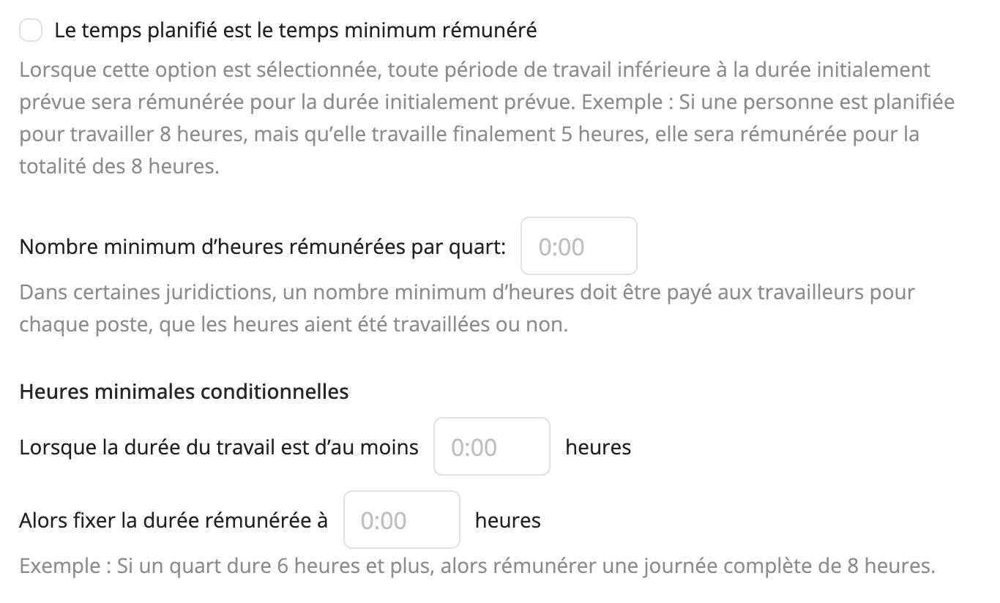
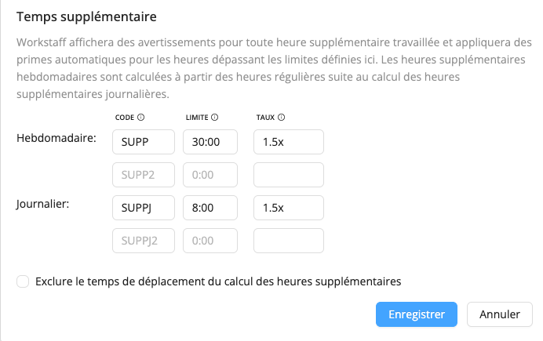

# Paramètres de la rémunération

Workstaff allows you to customize the way your remuneration is calculated for your account. To do so, head to the **Account** tab of the **Settings** section, and scroll down to **Remuneration**.

Once you input values in the chosen options, they will automatically be applied to shifts when the specified conditions are fulfilled.

## Calcul des heures supplémentaires
L'outil de calcul des heures supplémentaires de Workstaff permet de s'assurer que les employés sont correctement rémunérés pour le temps supplémentaire qu'ils ont effectué. Voici comment il fonctionne :

### Définition des règles relatives aux heures supplémentaires
Vous avez la possibilité d'établir jusqu'à deux règles hebdomadaires et deux règles journalières de calcul des heures supplémentaires. Ces règles définissent le nombre maximum d'heures que les employés peuvent travailler sans avoir à payer d'heures supplémentaires.

### Primes tarifaires automatisées
Workstaff applique automatiquement des primes de taux sur les heures travaillées au-delà des limites définies pour les heures supplémentaires. Les heures supplémentaires hebdomadaires sont calculées sur la base des heures normales, une fois que les heures supplémentaires journalières ont été comptabilisées.

