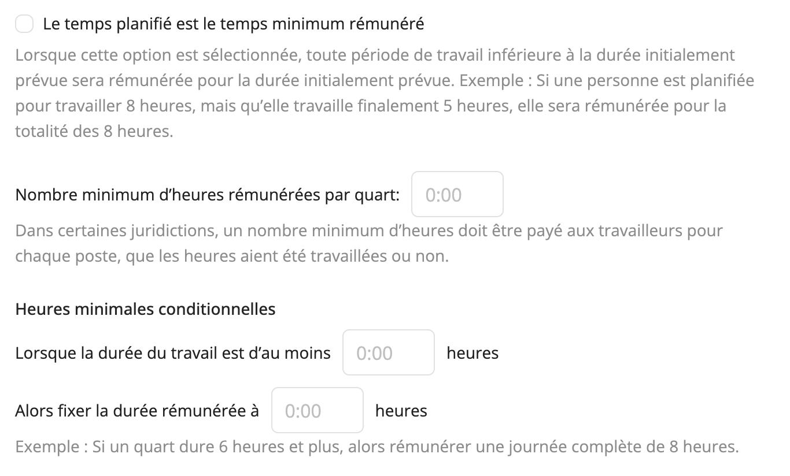

# Personnaliser la rémunération

Workstaff vous permet de personnaliser la façon dont la rémunération est calculée pour votre compte. Pour ce faire, rendez-vous dans l’onglet **Rémunération** de la section **Paramètres**.

Sélectionnez votre **Mode de paie par défaut** (Non défini, À l'heure ou Bénévole (non rémunéré)). Le mode que vous sélectionnez sera appliqué à tous les nouveaux événements.

Le choix de la **Méthode de calcul des heures** détermine comment les heures sont comptabilisées et affichées dans vos rapports - en particulier pour les quarts de travail de nuit qui s’étendent sur deux jours civils.
Vous pouvez choisir entre deux méthodes :
- Par date de début du quart de travail : toutes les heures sont comptées à la date de début du quart.
- Réparties sur les jours calendaires : les heures sont réparties entre les deux jours, selon le moment où elles ont été effectuées.

## Règles de rémunération

Une fois que vous avez saisi des valeurs dans les options choisies, celles-ci seront automatiquement appliquées aux quarts lorsque les conditions spécifiées seront remplies.

Pour en savoir plus sur la configuration des règles d’heures supplémentaires, consultez [Configurer les règles d’heures supplémentaires](overtime.md)

## Taux de rémunération standard

Les taux de rémunération standard s'appliquent à tous les membres de votre personnel lorsqu'aucun [taux de rémunération spécifique](../staff/rate-per-skill.md) n'est défini dans leur profil. Les taux individuels définis pour les travailleurs auront toujours la priorité sur les taux standard.