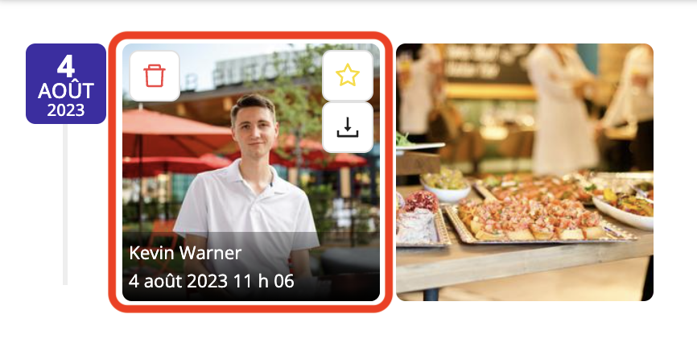
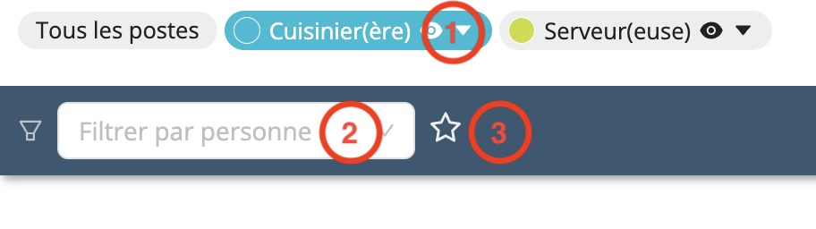

# Photos d'événements
Workstaff permet à votre personnel de publier des photos d'événements sur leurs quarts de travail.

Ces photos peuvent concerner aussi bien la mise en place de l'événement et les activités de l'équipe que les interactions avec les clients ou les participants. Les responsables peuvent avoir un aperçu visuel des événements et obtenir des informations précieuses sur le terrain.

Toutes les photos d'événements sont soigneusement organisées au sein des projets, ce qui permet de savoir qui les a publiées, de revoir les événements passés, de suivre les progrès et de les utiliser à des fins de référence ultérieure.

## Visualisation des photos d'événements

Pour visualiser les photos d'événements publiées par votre personnel, rendez-vous sur la page du projet, puis sur l'onglet **Photos**.

Toutes les photos postées par votre personnel seront affichées dans cet onglet.

En passant votre curseur sur les photos, vous pouvez afficher le nom de la personne qui les a postées et les options telles que :
- Marquer la photo comme favorite
- Télécharger la photo
- Supprimer la photo

Si vous devez supprimer plusieurs photos, vous pouvez cliquer sur **Sélection multiple**, puis sur le bouton **Supprimer**.

Workstaff vous permet également de filtrer les photos soumises par votre personnel :
1. Filtrer par rôle
2. Filtrer par personne
3. Afficher uniquement les photos favorites

Pour afficher les photos qui viennent d'être soumises par vos collaborateurs, vous pouvez cliquer sur le bouton **Actualiser**.

