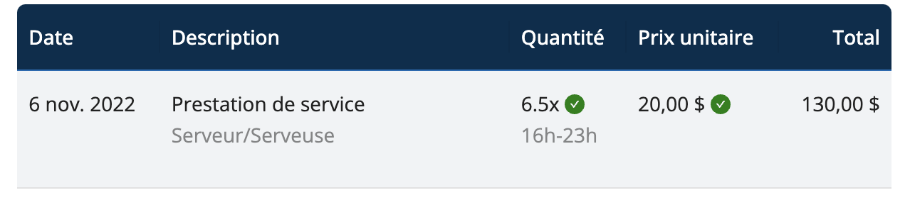
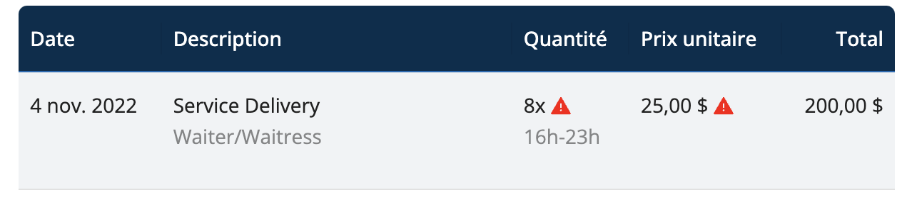

## Processus de facturation

<iframe width="640" height="306" src="https://www.loom.com/embed/08196f1caebd4aca9e869b3159ffdfb3" frameborder="0" webkitallowfullscreen mozallowfullscreen allowfullscreen></iframe>

## Soumission

Lorsque le personnel soumet une facture, vous pouvez la consulter dans la section **Factures** du menu principal.

Vous pouvez filtrer votre liste de factures de la manière suivante :
- Tout
- À approuver
- Approuvées
- Payées

## Conciliation

Lorsque le temps facturé correspond à la saisie des heures et que le taux horaire soumis correspond au taux affiché, Workstaff vous permet de le vérifier facilement en l'affichant sur la facture.

Si les informations ne correspondent pas, Workstaff vous montrera directement sur la facture quelles sont les données incorrectes afin que vous puissiez vérifier les informations et, si nécessaire, communiquer avec votre personnel pour qu'il soumette une nouvelle facture corrigée.

## Vérification
- Si les heures facturées correspondent aux heures prévues et si le taux horaire facturé correspond au taux planifié, les icônes de vérification sont vertes. 

- Si les heures facturées ne correspondent pas aux heures prévues et si le taux horaire facturé correspond au taux planifié, les icônes de vérification sont rouges. Passez votre curseur sur les icônes pour afficher le détail des vérifications. 
 

## Approbation

Si les informations figurant sur la facture sont correctes, cliquez simplement sur **Approuver**. Votre personnel sera informé de l'approbation de la facture sur l'application mobile et de la suite du processus.

## Téléchargement d'une facture

Vous pouvez exporter la facture au format pdf en allant dans **Actions** et en cliquant sur **Télécharger**.

## En savoir plus
Visitez la page [**Créez des factures pour votre travail**](../../workers/invoices.md) de notre Centre d’aide **pour les travailleurs** afin d’en savoir plus et de partager ces informations avec votre personnel. 
