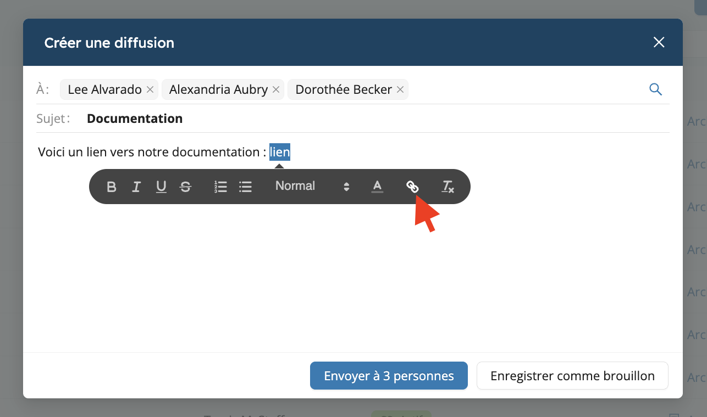
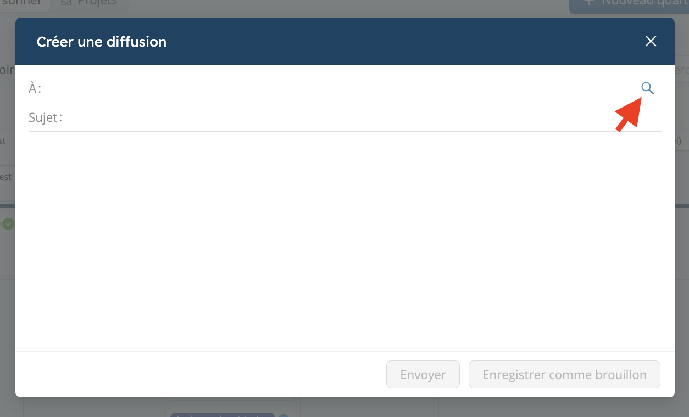
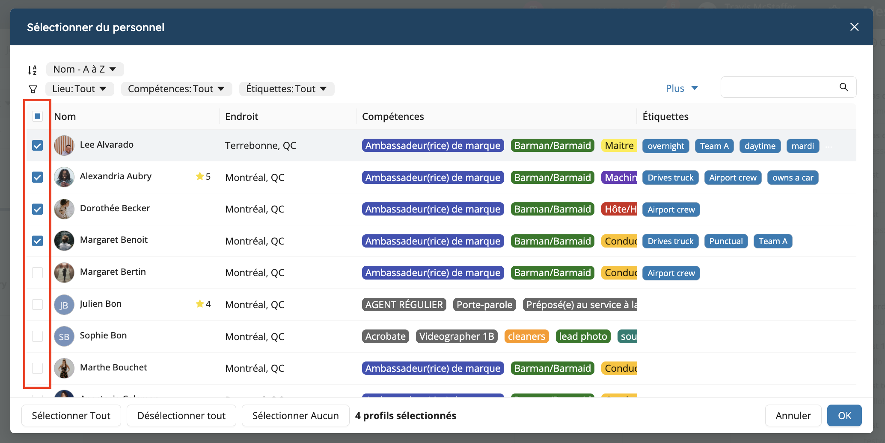

# Diffusions : Messages de masse

Les diffusions permettent d'envoyer rapidement et efficacement des messages de masse à l'ensemble de votre personnel. Ils sont souvent utilisés à la place des
courriels pour informer les équipes d'une information importante, leur demander de remplir leurs disponibilités pour des périodes d'activité intense ou tout autre besoin de communication unidirectionnelle.

Les diffusions sont envoyées individuellement à chaque membre de l'équipe, et chaque membre de l'équipe qui reçoit un message diffusé peut le marquer comme lu et/ou y répondre si un suivi est nécessaire.

<iframe width="640" height="308" src="https://www.loom.com/embed/9738951b06aa4c8ca5b5c5153dc0a635" frameborder="0" webkitallowfullscreen mozallowfullscreen allowfullscreen></iframe>

## Envoyer une diffusion

Pour envoyer une diffusion à votre personnel :

1. Ouvrez le tiroir **Messagerie** en haut à droite de l'interface utilisateur principale de Workstaff.
2. Cliquez sur l'onglet **Diffusions**.
3. Cliquez sur `+`.
4. Sélectionnez les destinataires dans le champ `À :`. Vous pouvez également ajouter plusieurs (ou tous) travailleurs en utilisant l'icône de recherche.
5. Indiquez un sujet et composez le corps de la diffusion, puis cliquez sur *Envoyer*.

### Insérer un lien dans une diffusion

Pour insérer un lien dans une diffusion :

1. Saisissez le texte que vous souhaitez transformer en lien.
2. Mettez le texte en surbrillance.
3. Cliquez sur l'icône de lien.
4. Saisissez l'URL.

Le texte sera ensuite cliquable et redirigera vers l'adresse indiquée.

### Envoyer une diffusion à plusieurs destinataires

Si vous souhaitez envoyer une diffusion à plusieurs personnes ou à tout le personnel, cliquez sur l'icône de loupe, puis sélectionnez le personnel soit un par un, soit en cliquant sur **Sélectionner tout**.

:::info
Lorsque vous envoyez une diffusion, votre personnel reçoit une notification push sur son téléphone et un courriel.
La notification push n'inclut pas le contenu de la diffusion proprement dite, alors que la notification par courriel le fait.
:::

## Réception des réponses aux diffusions

Les réponses individuelles du personnel aux diffusions seront reçues dans de nouvelles [**conversations 1:1**](./chat.md) entre l'expéditeur initial de la diffusion et le personnel qui a répondu.

## Supprimer une diffusion

Lorsqu'une diffusion devient obsolète ou non pertinente, vous pouvez la supprimer :

1. Cliquez sur la diffusion que vous souhaitez supprimer dans l'onglet **Diffusions** du tiroir principal **Messagerie**
2. En bas à gauche de la fenêtre de détails de la diffusion, cliquez sur **Actions** et **Supprimer**.

Une fois qu'une diffusion est supprimée, elle sera également supprimée de la boîte de réception de chaque destinataire.

:::note
Bien que la diffusion elle-même disparaisse lorsqu'elle est supprimée, toute conversation de réponse 1:1 associée sera conservée.
:::