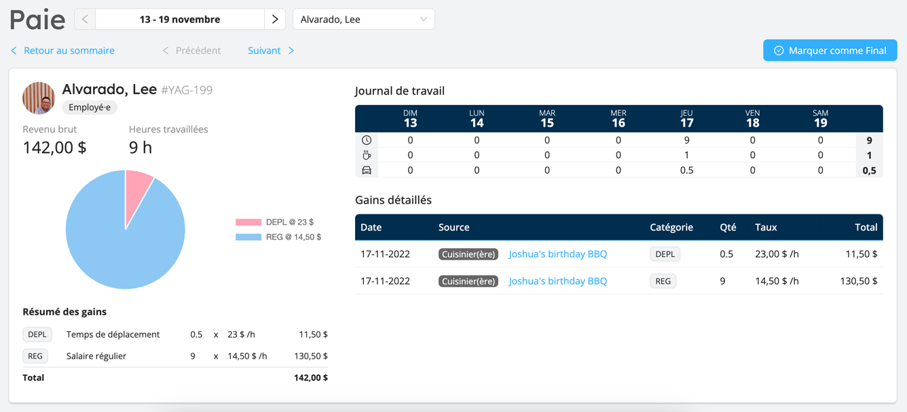

# Préparation de la paie

Le module Paie a été conçu pour faciliter la préparation et le traitement des paies de votre organisation.

Workstaff dispose déjà d'un puissant modèle de rémunération qui vous permet de définir précisément la manière dont vous rémunérez votre personnel.
Le module de paie va encore plus loin : il consolide tous les revenus de votre personnel au cours de chaque période de paie et
vous présente des chiffres et des rapports prêts à l'emploi qui peuvent être saisis dans votre logiciel de paie externe.

Lorsque vous traitez une période de paie avec le module Paie, celui-ci rassemble et compile toutes les entrées de temps approuvées des travailleurs qui
ont été affectés à des quarts pendant la période de paie, ainsi que les informations détaillées sur la rémunération - y compris les primes / différentiels.

Workstaff vous avertira de toute incohérence ou de toute donnée manquante dans vos périodes de paie et vous aidera à y remédier si nécessaire.
Pendant que vous travaillez sur les avertissements, vous pouvez générer à nouveau le rapport de cycle de paie pour refléter les modifications que vous avez pu apporter.

Une fois qu'une période de paie est satisfaisante, le module vous aide à suivre votre progression dans le traitement de la paie de chacun de vos employés en marquant
les talons comme _Finaux_. Lorsqu'un talon est marqué comme final, Workstaff le gèle afin que vous puissiez conserver les données historiques sans vous préoccuper 
d'éventuels changements non désirés dans vos données de paie.

Pour commencer avec la Paie, [continuez à lire](./start.md)...

:::info
Le module Paie est disponible sur le plan **Max**. Si vous êtes actuellement abonné au plan **Pro**, vous pouvez essayer le module avec
2 périodes de paies gratuites. Une fois que vous aurez traité 2 périodes, vous devrez passer à la formule **Max** pour continuer à utiliser cette fonctionnalité.
:::
