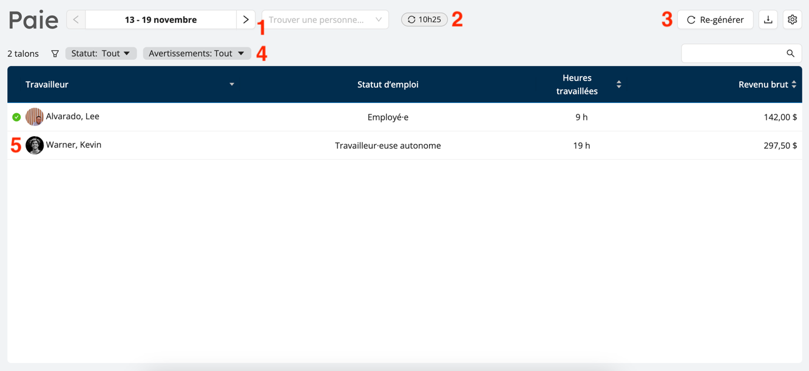
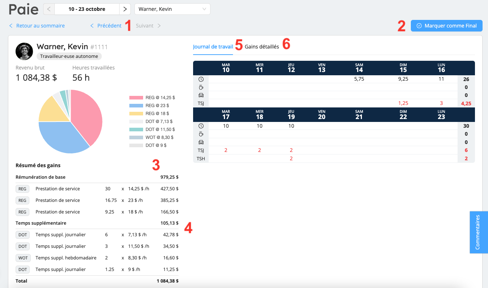
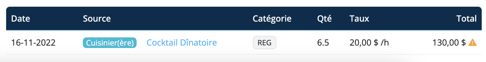
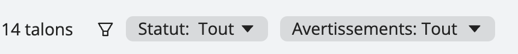

# Traiement de vos cycles de paie

Une fois que votre [période de paie initiale](./get-started.md) est créée, Workstaff vous montrera un résumé de tous les employés qui ont eu des revenus pendant la période de paie sous forme de talons.

:::info
Il est possible qu'après avoir généré un cycle de paie, certains de vos employés n'apparaissent pas ou que leurs données soient incomplètes. Si vous croyez que des données sont manquantes ou inexactes, assurez-vous d'abord que le statut d'emploi de votre équipe ainsi que leurs quarts de travail répondent aux [conditions préalables](./get-started.md#prerequisites) pour être pris en compte dans les cycles de paie.
:::

## Les périodes de paie sont des instantanés figés dans le temps

Chaque période de paie dans Workstaff est une photo de vos données de paie prise au moment où la période a été générée. Workstaff ne met pas automatiquement à jour les données de paie lorsque des ajustements sont apportés aux données sous-jacentes telles que la rémunération ou les entrées de temps.

Lorsque vous avancez sur le traitement de votre période de paie, vous pourriez avoir besoin d'ajuster la rémunération ou les entrées de temps. Lorsque vous le faites, Workstaff identifie les modifications et vous avertit que les données de paie ne sont pas à jour. Pour synchroniser les données de paie, vous devez re-générer manuellement la période de paie.

:::note
Les talons marqués comme **Finaux** ne sont pas re-générés automatiquement. Pour mettre à jour un talon qui a été marqué comme étant finalisé, vous devez d'abord le rouvrir, puis re-générer la période.
:::

## L'interface utilisateur de la paie

Le module Paie comporte 2 écrans principaux : l'écran de la période de paie et l'écran du talon de paie.

### Écran de la période de paie

L'écran de la période de paie présente une vue d'ensemble de tous les talons des employés, permet de les filtrer et de les trier et facilite le suivi de la progression du traitement de la paie.

1. **Navigateur**: Vous permet de vous déplacer rapidement dans les périodes de paie et les talons des employés.
2. **Moment de la génération** : Indique le moment où la période a été générée pour la dernière fois.
3. **Boutons d'actions**: Générez à nouveau la période de paie, téléchargez-la dans Excel et [redimensionnez la période de paie] (#resize).
4. **Filtres**: Permet de limiter les données affichées pour se concentrer sur des tâches spécifiques.
5. **Indicateurs d'avancement**: Au fur et à mesure que vous avancez sur le traitement de la paie et que vous marquez les talons comme traités, les crochets verts s'affichent à côté de l'identification du travailleur pour vous permettre de visualiser en un coup d'oeil votre progression.

### Écran de talon de paie

L'écran du talon de paie affiche, pour un travailleur à la fois, le résumé à haut niveau des revenus ainsi que les détails. Cet écran est conçu pour montrer tout ce dont vous avez besoin pour alimenter votre système de paie externe.

1. **Navigateur de talon**: Vous pouvez naviguer à travers les bulletins de paie sans avoir à revenir à l'écran principal de la période de paie pour les traiter.
2. **Bouton _Marquer comme Final_**: Marquez les talons comme définitifs une fois que vous les avez traités pour garder une trace de votre progression et indiquer à Workstaff de ne plus les modifier, même lors d'une nouvelle génération de la période de paie.
3. **Sommes des gains**: Il s'agit de la somme de tous les revenus, regroupés par code de gain et par taux. En règle générles, ce sont les chiffres qui devraient être saisis dans votre logiciel de gestion de la paie.
4. **Heures supplémentaires** : Workstaff applique automatiquement des primes de taux sur les heures travaillées au-delà des limites définies pour les heures supplémentaires. Les heures supplémentaires hebdomadaires sont calculées sur la base des heures normales après comptabilisation des heures supplémentaires journalières. Les primes d'heures supplémentaires hebdomadaires sont calculées sur la base d'une moyenne pondérée des salaires pour la période donnée.
5. **Journal de travail**: Ce tableau présente, pour chaque jour de la période, un résumé des heures travaillées, des pauses et des temps de déplacement. Il peut être utilisé pour identifier et quantifier rapidement les heures supplémentaires.
6. **Gains détaillés**: Ce tableau montre chaque entrée de salaire pour le travailleur sur la période et permet de naviguer facilement vers le projet correspondant si nécessaire.

## Avertissements et alertes

Une fois que les données ont été générées pour une période de paie, Workstaff vous avertit s'il y a des éléments manquants ou obsolètes.

Voici les différents avertissements possibles :

- **Certaines entrées de temps n'ont pas été approuvées** : cet avertissement indique que certaines saisies de temps au cours de la période de paie n'ont pas été approuvées, et n'ont donc pas été prises en compte dans la période de paie. Cliquez sur **Voir les feuilles de temps** pour visualiser et approuver ces feuilles de temps dans le module Feuilles de temps.
  
- **Certains quarts ne sont pas pris en compte** : cet avertissement apparaît lorsque de nouveaux quarts de travail ont été ajoutés ou approuvés après la dernière génération de la période de paie. En tant que telles, ces données ne sont pas encore incluses dans la période de paie, et cet avertissement signifie généralement que la période devrait être générée à nouveau. Cliquez sur **Re-générer** pour que les entrées de temps manquantes soient incluses et que les données de la période soient mises à jour.
  
- **Les données relatives à la rémunération pour certains quarts ont changé** : et avertissement indique si des modifications ont été apportées aux données de rémunération d'au moins un membre du personnel pour les quarts travaillés pendant la période.
  
- Si des données ne sont pas à jour, des avertissements apparaîtront également à l'extrême droite des talons de paie concernés dans l'écran de la période de paie :
  
- Pour en savoir plus sur le problème de chaque talon marqué d'un avertissement, cliquez dessus pour ouvrir l'écran du talon de paie. Une fois là, vous pouvez cliquer sur le quart marqué d'un avertissement sous **Gains détaillés** pour être redirigé vers la page du projet concerné.
  

## Recherche et filtration des talons

Workstaff vous permet de rechercher et de filtrer les talons de paie afin d'afficher uniquement les données pertinentes selon vos différentes tâches.

Si vous voulez trouver le talons d'un employé spécifique pour une période donnée, tapez son nom ou son numéro de fiche dans le champ de texte en haut à droite du tableau des talons.

Utilisez les filtres pour afficher les talons par statut (**Tous ; talons ouverts uniquement ; talons définitifs uniquement**) ou par avertissements connexes (**Afficher les talons obsolètes ; Afficher les talons avec des gains nuls**).

## Marquer les talons comme Finaux

Le module vous permet de savoir exactement où vous en êtes dans la préparation de votre paie. Marquez les talons finalisés en cliquant sur **Marquer comme Final**. Workstaff s'assurera alors que ses données restent intouchées, même si les données sous-jacentes, telles que la rémunération ou les entrées de temps, devaient changer.

## Exporter dans Excel

Tous les détails de l'entrée de la paie (y compris les codes de projet, les départements, les rôles travaillés, etc.) peuvent être exportés vers un fichier Excel pour automatiser votre traitement si nécessaire.

Pour exporter les données de la période vers un fichier Excel, cliquez sur l'icône de téléchargement:

## Créer la prochaine période de paie

Il est recommandé d'attendre la fin d'une période de paie pour créer cette période dans Workstaff et traiter les données.

Vous pouvez tout de même générer les données de la période en cours avant qu'elle ne soit terminée, si nécessaire.

## Redimensionner une période de paie existante {#resize}

Si nécessaire, Workstaff vous permet de redimensionner votre première et votre dernière période de paie (qui peut être la même période si vous venez de commencer à utiliser le module et que vous avez une seule période).

1. Cliquez sur l'icône représentant un engrenage en haut à droite de la page de la période de paie.
1. Sélectionner **Redimensionner la période...**.
  
1. Choississez une nouvelle date de début et/ou de fin.

:::note
Vous ne pouvez réduire ou prolonger une période de paie existante que par un nombre limité de jours. Cette durée dépend de votre calendrier de paie, mais en général, Workstaff ne vous permettra pas de prolonger une période plus de deux fois la taille d'une période de paie standard dans le calendrier de paie utilisé pour votre compte.
:::
