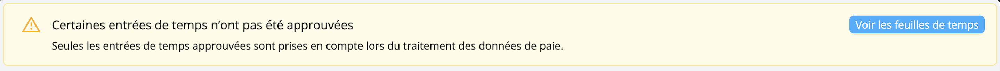

# Marche à suivre
Lorsque les feuilles de temps des quarts de travail rémunérés ont été soumises et approuvées,
les données qui y correspondent sont générées dans le module d’aide au traitement de la paie et sont figées, jusqu’à ce que vous re-génériez ces données, si nécessaire.

Il est préférable d’attendre que la période de paie soit terminée pour générer les données dans le module de paie. Vous pouvez, si vous le souhaitez, générer les données pour la période en cours avant qu’elle ne soit terminée. Dans ce cas-ci, lisez attentivement l’avertissement et cliquez sur **Je comprends, traiter la période paie incomplète maintenant**.

Workstaff vous indique le moment où les données de cette période de paie ont été générées pour la dernière fois.

## Identification proactive des problèmes
Une fois que les données ont été générées pour une période de paie, Workstaff vous avertit s’il en manque ou s’il vous reste des choses à faire.
- **Certaines entrées de temps n’ont pas été approuvées**: si cet avertissement s’affiche, cliquez sur **Voir les feuilles de temps** afin d’être redirigé vers la section **Suivi du temps** et de pouvoir approuver les feuilles de temps manquantes.
  

- **Certains quarts ne sont pas pris en compte**: si vous avez ajouté des quarts aux projets d’une période de paie après avoir généré les données, ces données ne sont pas incluses dans les données de cette période de paie. Cliquez sur **Re-générer** pour que les entrées de temps manquant soient incluses et que les données de la période soient à jour.
  
- **Les données relatives à la rémunération de certains quarts ont changé**:  cet avertissement s’affiche si des modifications ont été apportées aux données de rémunération d’au moins un membre du personnel pour les heures travaillées au cours de la période.
  
- Si des données sont obsolètes, des avertissements s’affichent aussi sur les talons de paie concernés.
  
- Pour en savoir plus sur la problème lié à chaque talons marqué d’un avertissement, cliquez dessus pour l’afficher. Une fois dans la talon de paie, vous pouvez cliquer sur le quart marqué d’un avertissement sous **Gains détaillés** pour être redirigé vers la page du projet concerné.
  

## Rechercher et filtrer vos talons de paie
Workstaff vous permet de rechercher et filtrer les talons de paie de manière à afficher des données spécifiques.

Si vous souhaitez trouver les talons de paie d’un.e employé.e spécifique pour une période données, tapez son nom dans **Trouver une personne**
Utiliser les filtres de recherche pour afficher les talons en fonction de 
- Leur **Statut** (Tout; Talons ouverts seulement; Talons finaux seulement) 
- Des **Avertissements** qui y sont liés (**Afficher les talons obsolètes; Afficher les talons avec des revenus à zéro**).

## Les talons de paie
Pour chaque employé.e, voyez en un coup d'œil un sommaire de tous ses gains et heures travaillées pendant la période de paie.
Pour afficher son talon de paie, cliquez sur son nom dans la liste de la période de paie.

Le Journal de travail permet, en un regard, de consulter le sommaire des heures travaillées par un.e employé.e pour chaque jour et chaque semaine de la période de paie et de quantifier les heures supplémentaires.

Pour naviguer facilement d’un talon de paie à un autre, cliquez sur **Précédent** et **Suivant**.

## Marquer comme final
Le module vous aide à suivre exactement où vous en êtes dans la préparation de votre paie. Marquez les talons finalisés en cliquant sur **Marquer sur final** Workstaff s’assurera que les données restent figées dans le temps.

## Exportez sur Excel
Tout le détail des entrées de paie - incluant les codes de projets, départements, rôles travaillés, etc. - peut être exporté dans un fichier Excel pour automatiser votre traitement si nécessaire.
Pour exporter les données de la période vers un fichier Excel, cliquez sur l’icône de téléchargement.

