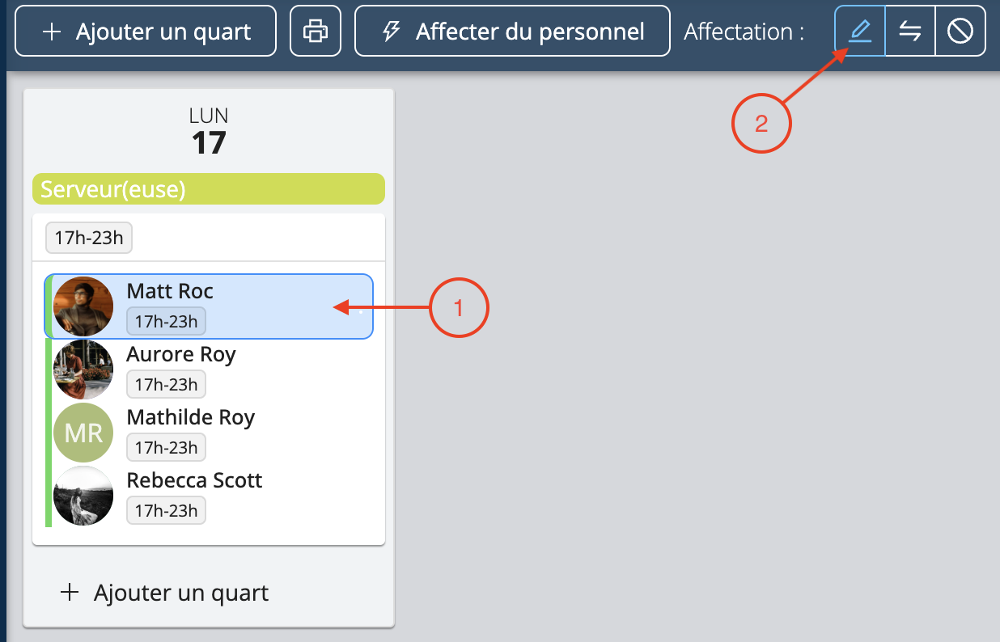

# Réservez votre équipe

Une fois que vous avez créé vos équipes, Workstaff vous permet d'affecter du personnel à des quarts de la manière suivante.

<iframe width="640" height="307" src="https://www.loom.com/embed/9b084fce0bc044f9a535f2b8a46111cc" frameborder="0" webkitallowfullscreen mozallowfullscreen allowfullscreen></iframe>

## Affecter du personnel à partir de votre liste de suggestions
Workstaff vous permet de sélectionner du personnel à partir d'une liste de suggestions basée sur les compétences, la disponibilité et les notes de chaque profil.
1. Sur la page du projet, sélectionnez le quart et cliquez sur **Affecter du personnel**
2. Sélectionnez le personnel que vous souhaitez réserver dans la liste de suggestions
3. Cliquez sur **Affecter X personnes**.

## Affecter du personnel à l'aide de l'Organiseur de candidats

L’organiseur de **Candidats** est un outil qui vous permet d'affecter du personnel de différentes manières.
Dans cet onglet, vous pouvez voir en un coup d'œil les **Candidats** qui ont appliqué aux postes que vous avez publiés et les **Suggestions** de personnel.

### Affecter des candidats qui ont posé leur candidature

1. Utilisez la barre de recherche et les filtres si vous recherchez des profils spécifiques
2. Dans l'organiseur de **Candidats**, placez votre curseur sur le nom du candidat
3. Cliquez sur **Réserver**
4. Sélectionnez le poste et le(s) quart(s) de travail pour lesquels vous souhaitez réserver le candidat
5. Cliquez sur **Affecter**.

Si une candidature ne vous intéresse pas, vous pouvez cliquer sur **Mettre de côté** à côté du nom du candidat. Vous pouvez décider ultérieurement de remettre un candidat que vous avez mis de côté dans la liste des candidats en cliquant sur **Garder** à côté de son nom.  

## Disponibilité du personnel

Lorsque les membres de votre personnel [**indiquent leur disponibilité via l'application mobile**](../../workers/availability.md), ces informations sont affichées dans différentes sections de la plateforme web, notamment:
- **La liste de suggestions du personnel**
- **L'organisateur de candidats**
- **La vue "Jour"** du calendrier

La disponibilité du personnel est indiquée par différentes couleurs:
- **Gris**: Aucune information de disponibilité fournie par le personnel.
- **Vert**: Le personnel a indiqué être disponible.
- **Orange**: Le personnel est partiellement disponible, et le créneau proposé chevauche sa période d’indisponibilité.
- **Rouge**: Le personnel a indiqué être indisponible.
- **Bleu**: Le personnel est déjà planifié pour tout ou partie du créneau que vous vous apprêtez à attribuer.

Ce système de codes couleurs vous permet de comprendre rapidement le statut de disponibilité de vos membres du personnel, facilitant ainsi la gestion efficace des quarts de travail et des affectations.

### Trier vos candidats
Après avoir cliqué sur le bouton **Garder** pour valider vos candidats, vous pouvez voir qui a postulé pour chaque poste en sélectionnant le poste et en vérifiant si un point bleu apparaît sur leur photo.

:::info
Conseils pour comprendre l'affichage des candidats :
- **Point bleu** : Indique que le candidat a postulé pour le poste.
- **Nom apparaissant en gris clair** : Cela signifie que la compétence requise pour le poste sélectionné est absente de son profil.
:::

### Affecter du personnel qui n'apparaît pas dans les suggestions
Si vous souhaitez réserver du personnel qui n'apparaît pas dans votre liste de suggestions, vous pouvez accéder à l'ensemble de votre liste de personnel en cliquant sur **+** dans l’organiseur de **Candidats**.
Vous pourrez alors rechercher des travailleurs spécifiques en utilisant la barre de recherche et les filtres. Une fois sélectionnés, ils seront ajoutés à l'organisateur de **Candidats**.

### Sélectionner le personnel sans l’affecter à des quarts
Si vous souhaitez dresser une liste du personnel qui travaillera sur votre projet sans l'affecter à un poste spécifique, vous pouvez également cliquer sur **+** dans l'organiseur **Candidats** pour l'ajouter à votre liste de candidats que vous pourrez réserver ultérieurement.

## Choisir un chef d'équipe 
Une fois que vous avez affecté une personne à un quart, vous pouvez choisir d'en faire un chef d'équipe. 
1. Sélectionnez l'affectation de la personne en cliquant sur la bulle de sa photo ou sur son nom dans le quart
2. Cliquez sur l'icône de crayon **Modifier**

3. Cochez **Chef d'équipe** et cliquez sur **Ok**.

## Développer et réduire les affectations
Lorsque vous inscrivez un grand nombre de personnes sur un projet, Workstaff réduit automatiquement les détails des affectations.
Vous pouvez librement développer et réduire les détails de toutes vos équipes en cliquant sur l'icône **Développer/Réduire** en haut à droite de la page du projet.
Vous pouvez également développer et réduire les détails de chaque affectation en plaçant votre curseur sur celle-ci et en cliquant sur l'icône **Développer/Réduire**.

