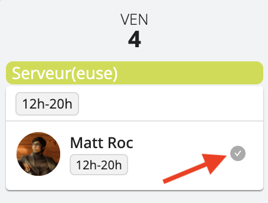
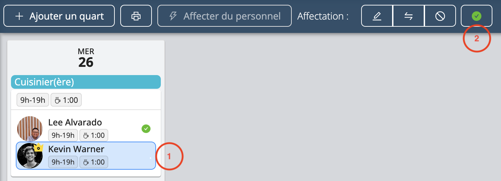

# Confirmation des horaires par le personnel

Lorsque vous affectez du personnel à un quart de travail ou que vous apportez des changements à un horaire, Workstaff leur envoie une notification pour leur demander de confirmer leur horaire de travail.

## Suivre l’état de la demande de confirmation

Workstaff vous permet de suivre l’état de la demande de confirmation envoyée à une personne en coup d'œil grâce à l’icône de confirmation se trouvant dans l’affectation, à côté du nom de la personne.

Si cette icône est :
- **Grise**: le quart est en attente de confirmation
- **Verte**: la personne a confirmé ce quart
- **Rouge**: la personne a demandé une annulation pour ce quart
- **Orange**: la personne n’a pas confirmé ce quart dans les délais prescrits.

## Et si la personne change d’avis ?
Si une personne a confirmé un quart, mais que, pour une raison quelconque, elle ne peut pas y travailler et doit l’annuler, elle doit contacter son responsable dès que possible afin que la modification soit faite dans l’horaire. 

## Et si la personne n'arrive pas à/oublie de confirmer son quart ?
Dans le cas où certaines personnes que vous avez affectées à des quarts de travail ne sont pas en mesure de confirmer leur affectation à ces quarts, vous avez la possibilité de le faire vous-même afin que toutes les informations concernant la planification de votre projet soient à jour.

Pour marquer un quart comme confirmée, sélectionnez l'affectation et cliquez sur le bouton **Marquer comme confirmé**.

## En savoir plus
Visitez la page [**Confirmer vos horaires**](../../workers/shifts/confirming-shifts.md) de notre Centre d’aide **pour les travailleurs** afin d’en savoir plus et de partager ces informations avec votre personnel. 
