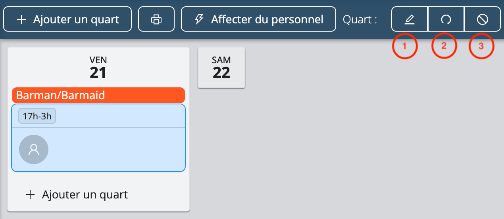
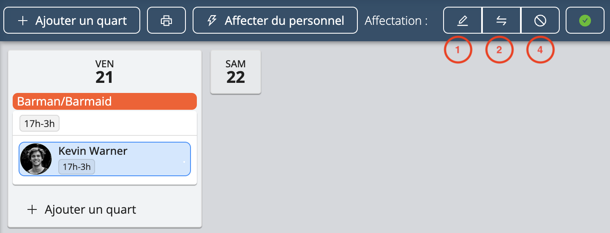

# Modifier les quarts et les affectations

Sur la page du projet, vous pouvez facilement modifier plusieurs quarts de travail ou plusieurs affectations à la fois.

<iframe width="640" height="306" src="https://www.loom.com/embed/6ee1dd771a8349efabcf148a89b5d036" frameborder="0" webkitallowfullscreen mozallowfullscreen allowfullscreen></iframe>

## Sélection de plusieurs quarts de travail
La sélection de plusieurs quarts de travail vous permet d'affecter du personnel aux quarts de travail sélectionnés et de les annuler en une seule manipulation.
- Pour sélectionner tous les quarts de travail sur la page du projet, double-cliquez sur un quart de travail
- Pour sélectionner plusieurs quarts de travail spécifiques sur la page du projet, appuyez sur la touche **Ctrl** (Windows) ou **Command** (macOS) et sélectionnez les quarts de travail que vous souhaitez modifier, comme suit:

## Sélection d'affectations multiples
La sélection de plusieurs affectations vous permet d'annuler plusieurs affectations à la fois.
- Pour sélectionner toutes les affectations d'un employé dans un projet, double-cliquez sur l'une de ses affectations, comme illustré ci-dessous.
- Pour sélectionner des affectations spécifiques, appuyez sur **Ctrl** (Windows) ou **Command** (macOS) et sélectionnez les affectations que vous souhaitez modifier.

## Modifier des quarts de travail
Workstaff vous permet de modifier, de répéter et de supprimer vos quarts de travail, même après avoir réservé du personnel.
Sélectionnez le quart que vous souhaitez modifier et suivez les instructions suivantes :
1. **Modifier un quart** : Cliquez sur le bouton **Modifier** pour modifier l’étiquette, l'heure prévue et le nombre de personnes nécessaires pour le quart
2. **Répéter un quart** : Cliquez sur le bouton **Répéter**, choisissez la date à laquelle vous souhaitez copier le quart. Notez que si vous avez déjà réservé du personnel pour cette équipe, il sera copié avec l'équipe
3. **Annuler un quart** : Cliquez sur le bouton **Annuler**.

## Modifier des affectations
Sélectionnez l’affection que vous souhaitez modifier en cliquant sur le nom de l'une des personnes que vous avez inscrites et suivez les instructions suivantes :
1. **Modifier une affectation** : Cliquez sur le bouton **Modifier** pour changer les heures de cette affectation spécifique et/ou fournissez un horaire détaillé pour chaque membre du personnel affecté à un quart.
2. **Remplacer le personnel** : Cliquez sur le bouton **Remplacer** après avoir sélectionné l’affectation et sélectionnez la personne avec laquelle vous souhaitez remplacer le membre du personnel.
3. **Annuler une affectation** : Cliquez sur le bouton **Annuler** et le poste sera vacant et prêt à être comblé par un autre membre du personnel. 

