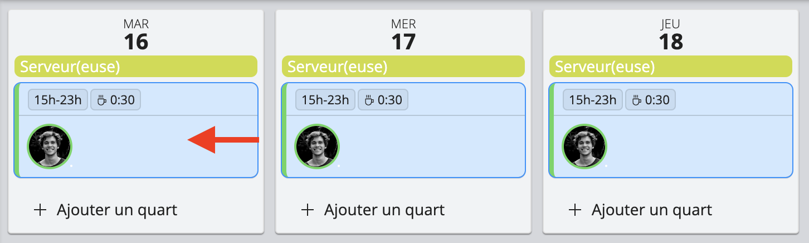
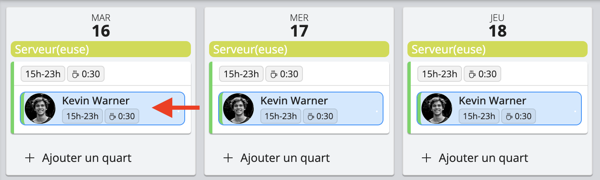

# Modifier les quarts et les affectations

Sur la page du projet, vous pouvez facilement modifier plusieurs quarts de travail ou plusieurs affectations à la fois.

<iframe width="640" height="306" src="https://www.loom.com/embed/6ee1dd771a8349efabcf148a89b5d036" frameborder="0" webkitallowfullscreen mozallowfullscreen allowfullscreen></iframe>

## Sélection de plusieurs quarts de travail
La sélection de plusieurs quarts de travail vous permet d'affecter du personnel aux quarts de travail sélectionnés et de les annuler en une seule manipulation.
- Pour sélectionner tous les quarts de travail sur la page du projet, double-cliquez sur un quart de travail
- Pour sélectionner plusieurs quarts de travail spécifiques sur la page du projet, appuyez sur la touche **Ctrl** (Windows) ou **Command** (macOS) et sélectionnez les quarts de travail que vous souhaitez modifier, comme suit:

## Sélection d'affectations multiples
La sélection de plusieurs affectations vous permet d'annuler plusieurs affectations à la fois.
- Pour sélectionner toutes les affectations d'un employé dans un projet, double-cliquez sur l'une de ses affectations, comme illustré ci-dessous.
- Pour sélectionner des affectations spécifiques, appuyez sur **Ctrl** (Windows) ou **Command** (macOS) et sélectionnez les affectations que vous souhaitez modifier.

## Modifier des quarts de travail
Workstaff vous permet de modifier, de répéter et de supprimer vos quarts de travail, même après avoir réservé du personnel.   
Sélectionnez le quart que vous souhaitez modifier et suivez les instructions suivantes :
1. **Modifier un quart** : Modifiez l’étiquette, l'heure prévue et le nombre de personnes nécessaires pour le quart.
2. **Changer de poste** : Modifiez le poste d’un quart de travail et de toutes les personnes qui y sont inscrites.
3. **Fractionner un quart** : Divisez une équipe pour répartir le temps planifié entre différents postes pour toutes les personnes affectées au quart.
4. **Répéter un quart** : Cliquez sur le bouton **Répéter**, choisissez la date à laquelle vous souhaitez copier le quart. Notez que si vous avez déjà affecté du personnel à ce quart, il sera copié avec le quart. 
5. **Annuler un quart** : Cliquez sur le bouton **Annuler** pour supprimer le quart.

## Modifier des affectations
Sélectionnez l’affection que vous souhaitez modifier en cliquant sur le nom de l'une des personnes que vous avez inscrites et suivez les instructions suivantes :
1. **Modifier une affectation** : Modifiez les heures de cette affectation spécifique et/ou fournissez un horaire détaillé pour chaque membre du personnel affecté à un quart.
2. **Changer le poste** : Modifiez le poste de la personne sélectionnée.
3. **Fractionner** : Divisez une réservation pour répartir le temps planifié entre différents postes pour la personne sélectionnée.
4. **Remplacer le personnel** : Sélectionnez la personne avec laquelle vous souhaitez remplacer le membre du personnel.
5. **Annuler une affectation** : Cliquez sur le bouton **Annuler** et le poste sera vacant et prêt à être comblé par un autre membre du personnel."e poste sera vacant et prêt à être comblé par un autre membre du personnel. 

## Annuler les dernières modifications
Workstaff vous offre la possibilité d'annuler les dernières modifications apportées à vos projets. Cette fonction sert de filet de sécurité, vous permettant de revenir en arrière et de corriger toute modification ou erreur.

1. **Annuler la modification précédente** : Cette fonction vous permet de revenir sur la dernière action effectuée dans votre projet. Qu'il s'agisse d'ajouter, de supprimer ou de modifier des quarts et des affections, cette fonction rétablit rapidement l'état antérieur du projet. Vous pouvez l'utiliser pour revenir sur une série d'actions, en annulant progressivement toutes les modifications effectuées depuis la dernière version enregistrée du projet.
2. **Annuler tout le brouillon** : Cette fonction vous permet d'annuler toutes les modifications non enregistrées et de ramener le projet à son dernier état enregistré. Si vous avez effectué plusieurs ajustements mais que vous souhaitez revenir à la version originale enregistrée sans avoir à annuler individuellement chaque changement, cette fonction efface toutes les modifications apportées au projet, ce qui permet de faire table rase pour les modifications ou les révisions ultérieures.

## Voir l'historique des actions
En cliquant sur **Voir l'historique des actions**, vous verrez un journal détaillé des activités récentes liées au projet, présenté sous forme de tableau.

Ce tableau comprend :
- **Date** : le jour et l'heure où l'action a été réalisée  
- **Utilisateur** : la personne ayant effectué l'action
- **Action** : une description de l'action (ex. : quart créé, personnel assigné, affectation annulée)

Cette vue permet de suivre facilement l'ensemble des modifications importantes apportées au projet de manière claire et transparente.

