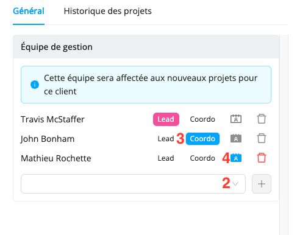

# Affecter des équipes de gestion à vos clients et projets 

Workstaff vous permet d’affecter des équipes de gestion spécifiques à chacun de vos clients et projets. Vous pouvez ajouter de personnes que vous le souhaitez à ces équipes et choisir lesquelles sont incluses dans les discussions d’équipe en lien avec ces projets. Chaque membre de l’équipe de gestion peut ainsi voir exactement quels sont les projets qui lui sont assignés dans le Calendrier, en choisissant d’afficher ses **horaires seulement**.

## Affecter une équipe de gestion à un client

Lorsque vous associez une équipe de gestion à un client, elle sera automatiquement affectée à tous les projets que vous créez pour ce client.

:::info  
Par défaut, la première personne affectée au client se voit attribuer les rôles de **Lead** et **Coordonnateur**. Le **Coordonnateur** est systématiquement le contact principal pour les projets du client, tandis que vous pouvez décider si le **Lead** est, ou non, une personne contact pour le personnel. Vous avez aussi la possibilité de choisir si les prochaines personnes que vous ajoutez à l’équipe de gestion sont des personnes contact pour le personnel ou non. Toutes les personnes contact seront incluses dans les conversations d’équipe.
:::

### Pour affecter une équipe de gestion à un client :

1. Vous pouvez afficher la fiche du client en tapant son nom dans la barre de recherche ou en cliquant sur son nom sur la page du projet 
2. Sous **Équipe de gestion**, cliquez sur la case vide et sélectionnez la prochaine personne que vous souhaitez ajouter à l’équipe, puis cliquez sur **+**
3. Sélectionnez le rôle de la personne (Lead, Coordo, ou aucun)
4. Si elle n’est pas **Coordonnateur**, déterminez si elle est une **Personne contact pour le personnel** en sélectionnant l’icône indiquée dans la capture d’écran ci-dessus 
5. Une fois l’équipe de gestion composée, cliquez sur **Sauvegarder**

## Affecter une équipe de gestion à un projet
Workstaff vous permet aussi d’affecter une équipe de gestion à chacun de vos projets, qu’ils soient associés à un client ou non.

:::note  
Si vous souhaitez affecter une équipe de gestion au projet d’un client auquel une équipe est déjà associée, c’est l’équipe affectée spécifiquement au projet qui en aura la charge.
:::

### Pour affecter une équipe de gestion à un projet :
1. Rendez-vous sur la page de votre projet
2. Cliquez sur l’icône de rouage, puis sur **Paramètres**
3. Sous **Équipe de gestion**, cliquez sur la case vide et sélectionnez la prochaine personne que vous souhaitez ajouter à l’équipe, puis cliquez sur **+**
4. Sélectionnez le rôle de la personne (Lead, Coordo, ou aucun)
5. Si elle n’est pas **Coordonnateur**, déterminez si elle est une **Personne contact pour le personnel** 
6. Une fois l’équipe de gestion composée, cliquez sur **Sauvegarder**
