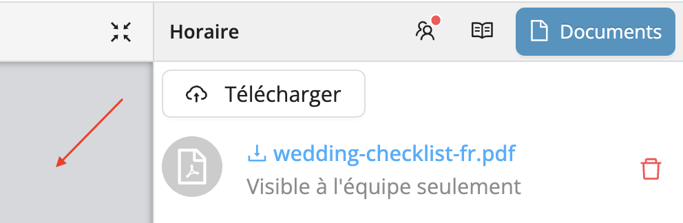

# Notes et Documents

Workstaff vous permet de partager facilement des informations importantes avec votre personnel, en téléversant des documents et en ajoutant des notes à différents niveaux du projet.

## Télécharger des documents

Vous pouvez téléverser des fichiers PDF, PNG ou JPG dans un projet afin de les rendre accessibles à vos employés.

**Pour téléverser un document**, cliquez sur la zone grise indiquée par la flèche. Dans le panneau latéral (appelé inspecteur), cliquez sur l’**icône de document**, puis sur **Télécharger** pour ajouter vos fichiers.

Une fois téléversés, les employés affectés au projet pourront consulter ces documents depuis l’application mobile, dans les détails de leur quart, sous la section **Lectures importantes**.

## Ajouter des notes

Les notes permettent de partager des consignes, du contexte ou des informations complémentaires avec votre équipe. Vous pouvez les ajouter à différents niveaux, selon vos besoins :

- **Notes globales** (dans l’onglet “Partagées au personnel”) : visibles par tous les employés affectés, ainsi que ceux visibles dans l’audience si une offre a été publiée.
- **Notes par compétence** (dans l’onglet “Partagées au personnel”) : visibles uniquement par les employés ayant une **compétence spécifique**.
- **Notes par quart** : visibles uniquement par les employés affectés à ce **quart spécifique**.
- **Notes privées** : visibles uniquement par les **gestionnaires**. Elles peuvent être ajoutées au **niveau du quart** ou au **niveau de l’horaire**.

:::note
Les notes sont identifiées par l’**icône en forme de livre ouvert** 📖 dans l’interface, pour les repérer facilement.
:::