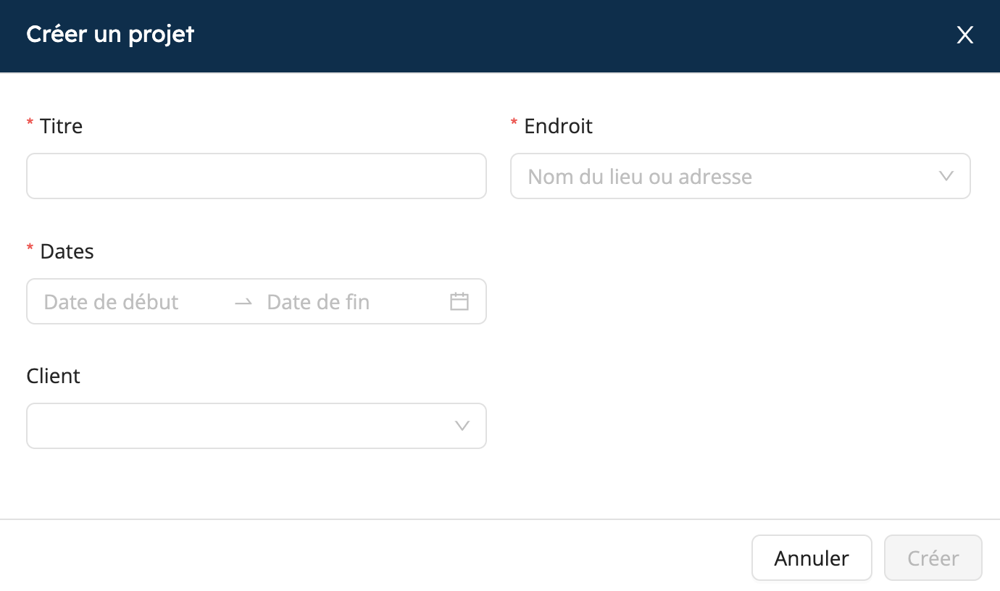

# Planifier un événement

## Créer un nouveau projet

Créer un projet dans Workstaff est une tâche rapide et facile:
1. Dans le menu principal, allez dans la section **Calendrier**.
2. Cliquez sur **Nouveau projet**.
3. Remplissez les informations ci-dessous afin de créer la base pour détailler le projet plus tard

## Ajouter des quarts de travail
Une fois que vous avez créé votre projet, vous pouvez ajouter des quarts de travail :
1. Sur la page du projet, cliquez sur **Ajouter un quart**.
2. Sélectionnez la ou les dates
3. Choisissez le poste pour le quart dans votre liste de compétences
4. Sélectionnez les heures de début et de fin
5. Remplissez le nombre de personnes nécessaires
6. Si vous le souhaitez, vous pouvez ajouter une étiquette et sélectionner les temps de pause et de déplacement.

## Mode brouillon

Lorsque vous créez un nouveau projet, Workstaff vous fait travailler en mode brouillon par défaut. Cela vous permet d'apporter toutes les modifications que vous souhaitez et de les appliquer au projet une fois que vous êtes satisfait en cliquant sur **Réviser et appliquer** sur la page du projet. Ce n'est qu'à ce moment-là que votre personnel recevra une notification concernant ses affectations.

Vous pouvez toujours apporter des modifications à votre projet après l'avoir révisé et appliqué, et ces nouvelles modifications feront automatiquement repasser votre projet en mode brouillon.

:::note
Il est essentiel que vous **Réviser et appliquer** les modifications apportées à votre projet régulièrement afin de garder vos informations à jour et d'éviter de submerger le projet avec des changements massifs lors de la révision et de l'application.
:::