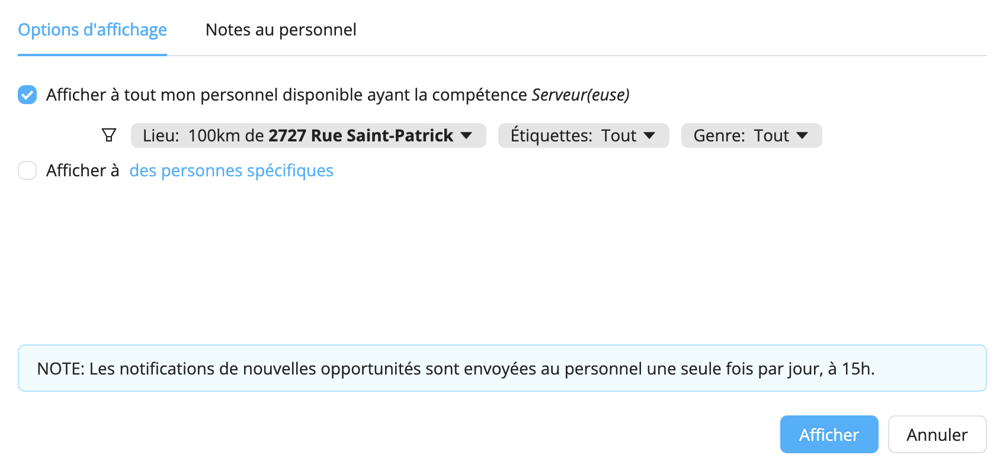

# Afficher des offres 
Workstaff vous permet d'afficher des postes, ce qui signifie essentiellement que vous pouvez publier des offres que vos employés peuvent consulter et auxquelles ils peuvent appliquer depuis leur téléphone portable. Les notifications de nouvelles offres sont envoyées au personnel une fois par jour à 15 heures, heure locale. Lorsque les employés ont appliqué au quart que vous avez publié, vous pouvez choisir qui affecter à partir d'une liste de candidats.

<iframe width="640" height="307" src="https://www.loom.com/embed/bafe986b976c41b9babb04a8b0664aeb" frameborder="0" webkitallowfullscreen mozallowfullscreen allowfullscreen></iframe>

## Affichage d'un poste
1. Sur la page du projet, allez à **Affichage**
2. Sélectionnez le poste que vous souhaitez publier
3. Sous **Options d'affichage**, vous pouvez sélectionner si vous souhaitez afficher le poste :
- **à tout mon personnel disponible ayant la compétence correspondante** : vous pouvez utiliser les filtres pour affiner votre recherche
- **à des personnes spécifiques** : vous pouvez sélectionner le personnel auquel vous souhaitez envoyer l'offre
4. Allez dans la rubrique **Notes au personnel** pour ajouter toute information supplémentaire que les candidats peuvent lire à l'ouverture de l'offre
5. Choisissez le mode de notification pour cette offre : 
- **Normal**: le personnel sera informé lors de la prochaine fenêtre de notification à 15h, heure locale
- **Urgent**: le personnel sera immédiatement informé avec une mention claire que l'opportunité est urgente 
6. Cliquez sur **Afficher**.

Si vous souhaitez à tout moment retirer l'affichage, allez dans l'onglet **Affichage**, sélectionnez le poste et cliquez sur **Retirer l'affichage**. 

Vous pouvez également choisir de ré-afficher une offre après l'avoir retirée, tout en conservant en mémoire les personnes qui ont déjà consulté et appliqué à cette offre en cliquant sur **Ré-afficher**.

:::info
Si vous créez de nouveaux profils de personnel qui sont concernés par des offres de travail affichées avant leur ajout à la plateforme, ces personnes seront en mesure de consulter ces offres dès leur première connexion à l'appli mobile.
::: 

## Marquer un poste comme étant comblé
Une fois que les candidats ont posé leur candidature et que vous avez affecté du personnel pour au(x) quart(s), vous pouvez sélectionner le poste sur votre page de projet et cliquer sur **Marquer comme comblé...**. L'offre sera retirée et les candidats non-inscrits seront informés par un message de courtoisie leur indiquant que le poste a été comblé.

## En savoir plus
Visitez la page [**Trouver du travail**](https://help.workstaff.app/fr/docs/workers/shifts/offers/) de notre Centre d’aide **pour les travailleurs** afin d’en savoir plus et de partager ces informations avec votre personnel. 
