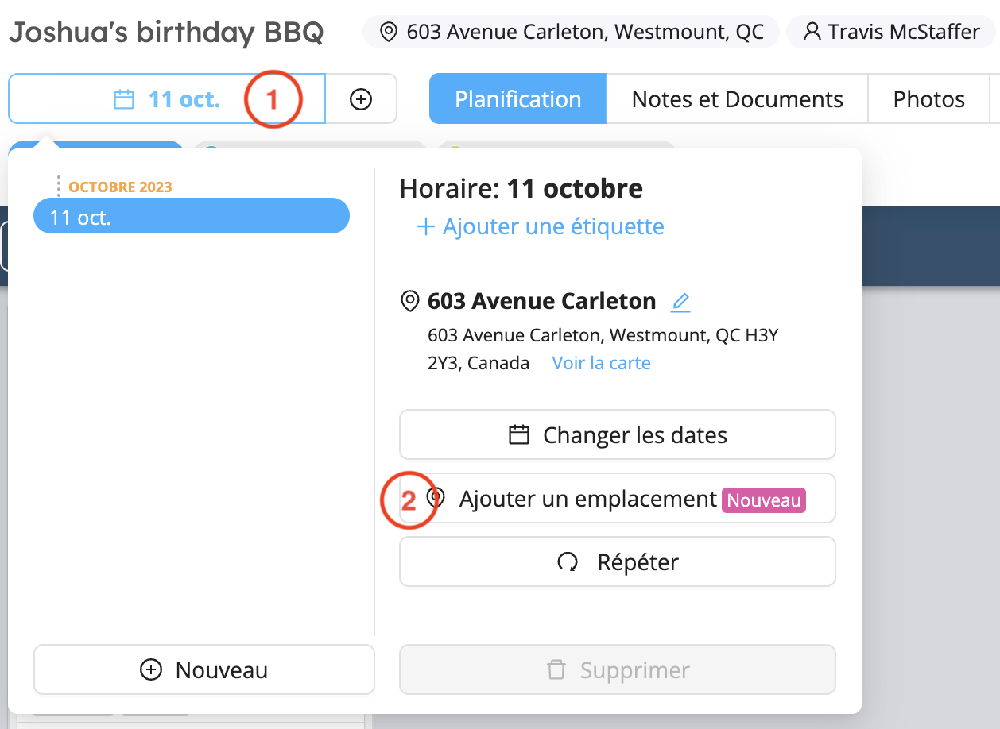
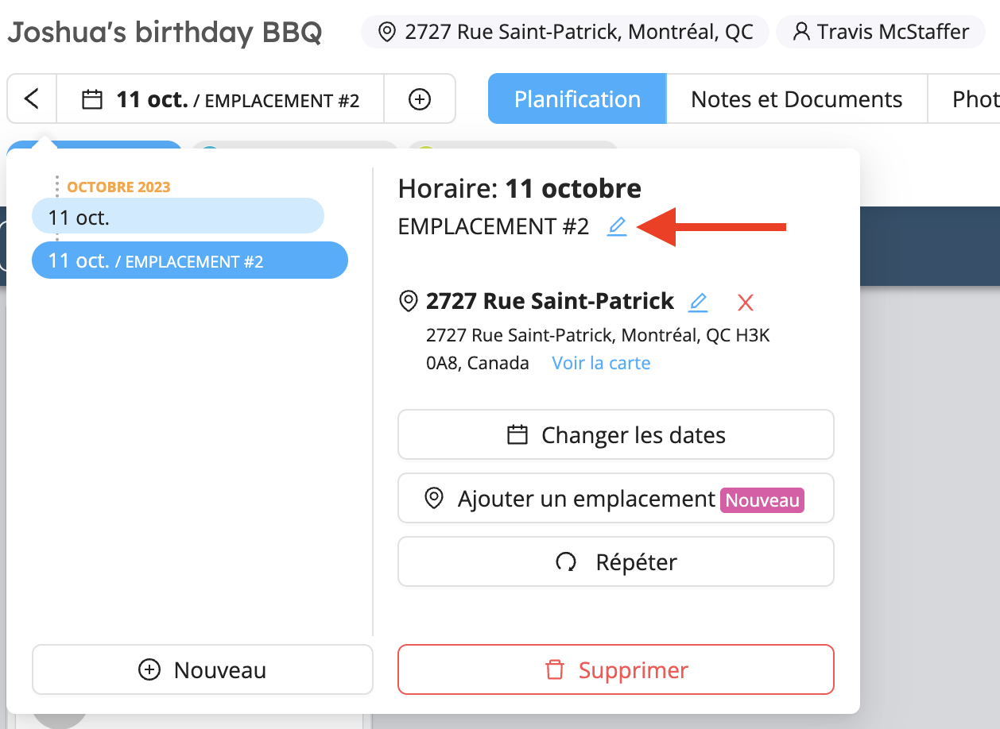

# Projets de longue durée

Que vous souhaitiez créer des événements qui s'étendent sur une longue période ou créer des horaires qui se répètent d'une semaine à l'autre, Workstaff vous permet de diviser votre projet en horaires de la manière indiquée ci-dessous.

<iframe width="640" height="307" src="https://www.loom.com/embed/2a62dfa6453e4d0caad76d4b3abc47de" frameborder="0" webkitallowfullscreen mozallowfullscreen allowfullscreen></iframe>

## Création d'un nouvel horaire

1. Sur la page du projet, cliquez sur le tiroir **Horaire**
   
2. Cliquez sur **Nouveau**
3. Sélectionnez les dates et indiquez si vous souhaitez copier l'horaire à partir d'un horaire existant dans le projet
4. Une fois le nouvel horaire créé, vous pouvez modifier son emplacement s'il est différent de l'emplacement initial du projet.
5. Vous pouvez ensuite créer des quarts de travail dans ce nouvel horaire.

## Répéter un horaire

Si votre horaire suit toujours la même structure, vous avez la possibilité de répéter un horaire que vous avez déjà créé dans le projet autant de fois que vous le souhaitez.

1. Sur la page du projet, cliquez sur le tiroir des horaires.
2. Cliquez sur **Répéter**
3. Sélectionnez les dates du nouvel horaire
4. Sélectionnez les dates à partir desquelles vous souhaitez **Copier**
5. Choisissez si vous souhaitez **Affecter la même équipe** pour ce nouveau calendrier.
   

## Modifier un horaire

1. Cliquez sur l'onglet des horaires et sélectionnez l'horaire que vous souhaitez modifier
2. Vous pouvez **Ajouter une étiquette**, changer le lieu et les dates
3. Une fois que vous avez sélectionné un horaire, vous pouvez modifier vos quarts et vos affectations.
   

## Supprimer un horaire

Pour supprimer un horaire, sélectionnez-le dans le tiroir des horaires et cliquez sur **Supprimer**. 

## Ajouter un emplacement

Si vos projets comportent plusieurs sites, Workstaff vous permet de créer des horaires pour différents emplacements le même jour au sein d'un seul et même projet.
Voici les étapes à suivre :

1. Sur la page du projet, cliquez sur l'onglet des horaires
2. Cliquez sur **Ajouter un emplacement**
   
3. Saisissez la nouvelle adresse
4. Sélectionnez si vous souhaitez **copier l’horaire actuel à cet emplacement** afin de copier le/les même(s) quart(s) vers le nouveau lieu
5. Une fois que le nouveau lieu a été ajouté, vous pouvez modifier son libellé, et il sera également affiché dans le calendrier après le titre du projet.
   
