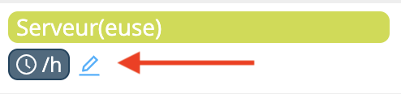
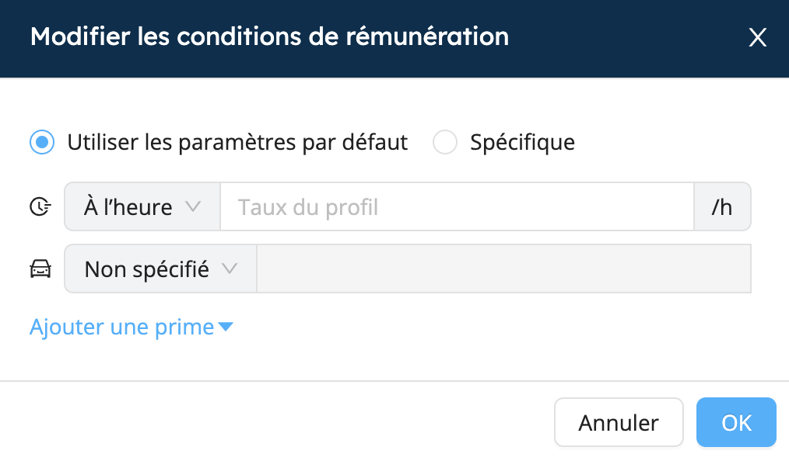

# Primes et rémunération

Workstaff vous permet de créer vos propres primes que vous pourrez ensuite ajouter aux conditions de rémunération de vos projets, si nécessaire.

Vous pouvez également personnaliser les conditions de rémunération de votre personnel et voir en un coup d'œil tout ce qui est applicable à chaque quart.

<iframe width="640" height="308" src="https://www.loom.com/embed/e9a0800a01714838b2cf5adada3a6ab9" frameborder="0" webkitallowfullscreen mozallowfullscreen allowfullscreen></iframe>

## Modifier les conditions de rémunération d'un poste
Lors de la création d'un événement, vous pouvez modifier les conditions de rémunération pour un poste spécifique. Si elles restent inchangées, la rémunération sera la même que dans les profils du personnel.
1. Sur la page du projet, accédez à l'onglet **Rémunération**.
2. Cliquez sur l'icône indiquée ci-dessous pour modifier les conditions de rémunération du poste.
   
3. Sélectionnez le type de rémunération et inscrivez le nouveau montant.
4. Vous pouvez ajouter des primes précédemment créées dans vos **Paramètres**.
   

Une fois modifiée, la rémunération sera applicable pour tous les quarts de travail avec cette position dans ce projet. Vous pouvez toujours modifier les conditions de rémunération pour des quarts de travail spécifiques.

## Modifier les conditions de rémunération pour un quart de travail spécifique
Workstaff vous permet également de personnaliser les conditions de rémunération pour des quarts de travail spécifiques.

1. Sélectionnez le quart que vous souhaitez modifier.
2. Choisissez le type de rémunération et le montant
3. Ajoutez des primes au quart si nécessaire.
