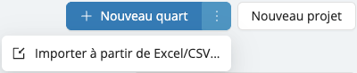

# Outil d'import de projets et de quarts

Besoin de créer plusieurs projets en une seule fois, chacun avec ses propres horaires et quarts ? Notre nouvel outil d'import en masse rend cela simple et rapide.  
Que vous soyez en train d’intégrer un nouveau client, de vous préparer pour une période chargée, ou que vous souhaitiez simplement gagner du temps, vous pouvez désormais tout importer en quelques clics — directement à partir d’un fichier Excel ou CSV.

Cette fonctionnalité vous permet de :
- Créer plusieurs projets en un seul import.
- Ajouter des horaires et des quarts à chaque projet.
- Éviter les saisies manuelles répétitives.

Téléchargez un [exemple de fichier](https://employer.workstaff.app/en/assets/import-templates/shift-import.csv) pour commencer.

## Prérequis
- Si les projets que vous importez sont liés à un client, assurez-vous d’[**ajouter le client**](../clients/manage-client-list.md#ajouter-un-nouveau-client) dans Workstaff au préalable.
- Vérifiez que toutes les compétences (skills) utilisées dans les projets à importer existent déjà dans votre compte Workstaff.

:::info
Pour ajouter des quarts à un projet existant, veuillez spécifier le code du projet (project code) et/ou le titre du projet (project title).  
Si vous souhaitez que les nouveaux quarts soient ajoutés à un horaire déjà existant, pensez à inclure également le libellé de l’horaire (schedule label).
:::

## Règles d'import

| **Champ**                 | **Obligatoire ?** | **Notes**                                                                                                                                                                                                            |
|---------------------------|-------------------|----------------------------------------------------------------------------------------------------------------------------------------------------------------------------------------------------------------------|
| Client Code               | Non               | Si renseigné, identifie le client en combinaison avec le nom du client (si également fourni).                                                                                                                       |
| Client Name               | Non               | Si renseigné, identifie le client en combinaison avec le code client (si également fourni).                                                                                                                         |
| Project Code              | Non               | Identifiant combiné du projet (avec le titre). Utilisez le même identifiant pour que plusieurs quarts soient créés sous le même projet.                                                                            |
| Project Title             | Non               | Identifiant combiné du projet (avec le code). Titre du projet.                                                                                                                                                      |
| Project Location          | Non               | Adresse complète du lieu, qui sera résolue via Google Maps. Si non fournie, l'adresse par défaut du client (si trouvée) ou celle du compte sera utilisée.                                                          |
| Schedule Label            | Non               | Chaîne de caractères arbitraire pour identifier l’horaire. Si plusieurs lignes utilisent la même étiquette, les quarts seront créés dans le même horaire Workstaff. Maximum 40 caractères.                         |
| Schedule Location         | Non               | Adresse complète de l’horaire, résolue via Google Maps. Si non fournie, l’adresse du projet sera utilisée.                                                                                                          |
| Schedule Notes - Internal | Non               | Notes internes pour l’horaire.                                                                                                                                                                                      |
| Schedule Notes - Staff    | Non               | Notes visibles par les membres de l’équipe assignés à l’horaire. Peut contenir des retours à la ligne ("\\n"). Les liens seront convertis en liens cliquables.                                                     |
| Schedule Position Notes   | Non               | Notes visibles par les membres assignés à l’horaire et à la position spécifiée dans le champ "Shift Skill". Peut contenir des retours à la ligne ("\\n"). Liens transformés en liens cliquables.                   |
| Shift Date                | Oui               | Format ISO-8601 (ex : "2025-05-23")                                                                                                                                                                                  |
| Shift Start Time          | Oui               | Heure de début du quart, au format 24h (ex : "16:45")                                                                                                                                                               |
| Shift End Time            | Non               | Heure de fin du quart. Si non fournie, une durée devra être indiquée (voir champ suivant). Format 24h (ex : "16:45")                                                                                                 |
| Shift Duration Minutes    | Non               | Durée prévue du quart (en minutes). Utilisée uniquement si "Shift End Time" n’est pas renseigné. Ex : "360" pour 6 heures                                                                                           |
| Shift Pause Duration      | Non               | Durée de la pause non rémunérée (en minutes). Ex : "30" pour 30 minutes.                                                                                                                                            |
| Shift Skill               | Oui               | Nom de la compétence (Skill) telle que configurée dans le compte Workstaff.                                                                                                                                         |
| Shift Travel Duration     | Non               | Durée du déplacement (en minutes). Ex : "120" pour 2 heures.                                                                                                                                                        |
| Shift Positions           | Non               | Nombre de postes à pourvoir pour ce quart. Par défaut : 1.                                                                                                                                                          |
| Shift Label               | Non               | Étiquette personnalisée pour ce quart. Maximum 40 caractères.                                                                                                                                                       |
| Shift Notes - Internal    | Non               | Notes internes pour le quart.                                                                                                                                                                                       |
| Shift Notes - Staff       | Non               | Notes visibles par le personnel assigné au quart. Peut contenir des retours à la ligne ("\\n"). Les liens seront transformés en liens cliquables.                                                                  |

## Importer votre fichier

Lorsque vous remplissez le fichier d’import, veillez à inclure les informations clés comme le nom du projet et la localisation sur **chaque ligne**. Si ces informations sont absentes ou différentes d'une ligne à l'autre, le système considérera qu’il s’agit de projets différents et créera plusieurs projets au lieu de regrouper les quarts sous un même projet.

Une fois votre fichier prêt, vous pouvez l’importer depuis l’onglet **Calendrier**, en cliquant sur les trois points à droite du bouton “Nouveau quart”, puis en sélectionnant **Importer**.  
Si vous ne voyez pas cette option dans votre compte, merci de [nous contacter](mailto:support@workstaff.app) pour que nous l’activions pour vous.

Lors de l’import, le système détectera automatiquement les éventuelles erreurs et les affichera avant la finalisation. Vous pourrez alors les corriger avant de relancer l'import.

:::warning
Nous vous recommandons de tester votre fichier avec un ou deux projets dans un premier temps, avant de lancer un import plus large.
:::

## Suivi de l’import

Vous pourrez suivre la progression de l’import directement dans l’interface.  
Une fois l’import complété à 100 %, vos projets et quarts seront créés — vous pourrez alors assigner du personnel !