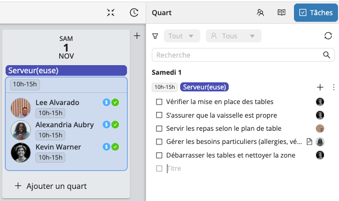

# Tâches de quart

Les **Tâches de quart** vous aident à **organiser, suivre et communiquer** ce qui doit être fait avant, pendant ou après un quart — afin de garder votre équipe alignée et vos opérations fluides.  
Qu’il s’agisse de préparer du matériel, d’accueillir sur le lieu d’un événement ou de ranger après une activité, les Tâches de quart vous donnent une visibilité complète sur ce qui a été fait et ce qu’il reste à faire.  

## Créer des tâches

1. Sélectionnez le **quart** auquel vous souhaitez ajouter des tâches.  
2. Ouvrez l’onglet **Tâches** dans l’inspecteur à droite de votre écran.  
3. Cliquez sur **+** pour ajouter une tâche.  
4. Entrez un **titre** puis appuyez sur **Entrée**. 

Vous pouvez aussi ajouter des **instructions détaillées** en cliquant sur l’icône en forme de feuille, située à droite lorsque vous survolez la tâche.

## Enregistrer votre liste de tâches comme modèle

Pour réutiliser votre liste de tâches sur d’autres quarts ou projets, cliquez sur les **trois points** en haut à droite de votre liste et sélectionnez **Enregistrer comme modèle**.

Ensuite, pour appliquer votre modèle à un autre quart, cliquez sur le **+** à gauche des trois points et sélectionnez **Ajouter à partir d’un modèle**.

## Assigner des tâches

Pour assigner une tâche à un **membre du personnel spécifique**, cliquez sur l’avatar vide à droite de la tâche.

:::info
Si une tâche est assignée **moins de 4 heures avant le début d’un quart**, le membre du personnel recevra une **notification push**.  
Il pourra retrouver la tâche dans son **application Workstaff**, dans les détails du quart, et la **marquer comme complétée** une fois terminée.
:::

### Permissions des chefs d’équipe

Lorsqu’un chef d’équipe est désigné sur un quart, il bénéficie de droits supplémentaires pour faciliter la gestion des tâches :
- Il peut **marquer une tâche comme complétée**, y compris pour un autre membre du personnel.  
- Il peut **assigner ou réassigner** une tâche à un autre membre de l’équipe.  
- Il reçoit une **notification** chaque fois qu’un membre de son équipe complète une tâche.
- Il peut également retirer le statut **complétée** d’une tâche si nécessaire.

Grâce à ces permissions, le chef d’équipe peut suivre en temps réel l’avancement des tâches et s’assurer que tout est réalisé conformément aux attentes.