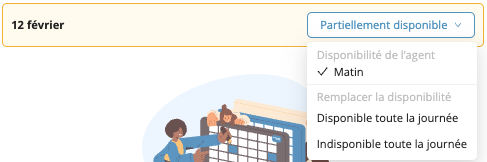

# Le profil du personnel

En plus des informations de contact de base, Workstaff permet de fournir beaucoup plus d'informations. Pour spécifier des informations de profil supplémentaires, ouvrez le tiroir de la fiche du personnel en cliquant sur n'importe quel membre du personnel dans la section principale **Personnel**.

Le tiroir du profil du personnel est aussi généralement accessible en cliquant sur n'importe quel avatar du personnel dans l'interface utilisateur de Workstaff.

## Informations de contact

Workstaff permet de modifier les informations personnelles du personnel (telles que le nom, la date de naissance, la ville de résidence) des profils [**non réclamés**](#profils-réclamés-et-non-réclamés) Pour modifier ces informations, cliquez sur le bouton stylo à côté du nom du personnel.

## Notation par étoiles

Vous pouvez noter chaque employé sur une échelle de 5 étoiles. Cette information est principalement utilisée pour trier le personnel dans les listes automatiques fournies par Workstaff dans différentes zones de l'interface utilisateur. Les profils ayant les meilleures notes en étoiles seront généralement affichés en premier lorsque cela est logique.

## Étiquettes

Les étiquettes sont de simples libellés qui peuvent être associés à chaque profil. Elles sont principalement utilisées pour [**classer**](./organizing.md) votre personnel et faciliter la [**recherche**](./search.md) dans votre base de données.

## Champs personnalisés (Pro uniquement)

Chaque [**champ personnalisé**](../customize/custom-fields.md) que vous avez défini dans les paramètres de votre compte sera répertorié sur le profil du personnel afin que les valeurs réelles puissent être fournies.

Ces informations ne peuvent pas être modifiées par le personnel.

## Compétences

Chaque membre du personnel peut fournir un ensemble de compétences qui lui sont propres lorsqu'il rejoint Workstaff via l'application mobile. Mais, en tant qu'employeur, vous avez toujours le contrôle total sur les compétences que vous souhaitez associer à chaque travailleur.

Le panneau **Compétences** vous permet de sélectionner un ensemble de compétences que vous considérez comme valables pour chaque employé. Toutes les compétences fournies par le personnel dans son profil seront affichées sous forme de suggestions, que vous êtes libre de conserver ou non. Vous pouvez également ajouter toute autre compétence si nécessaire.

Il est essentiel que les bonnes compétences soient associées à chaque membre du personnel pour utiliser Workstaff efficacement. Voir [**Organiser et classer votre personnel**](./organizing.md) pour plus de détails.

## Détails supplémentaires

Les sections **À propos**, **Langues parlées**, **Expériences professionnelles** et **Transport** peuvent être remplies par les travailleurs directement dans l'application mobile une fois qu'ils ont [**réclamé**](#profils-réclamés-et-non-réclamés) leur compte.

## Informations de contact

Vous pouvez consulter et modifier les informations de contact de chaque travailleur dans l'onglet **Contact**.

Une fois qu'un profil a été réclamé par un travailleur, lui seul peut modifier ses coordonnées.

## Détails de l'emploi

### État (actif/inactif)

Il peut arriver que vous ayez besoin de masquer temporairement certains de vos employés sans supprimer complètement leur profil de votre base de données (ex : travailleurs saisonniers, en congé parental, etc.).
Dans ce cas, vous pouvez rendre un profil inactif. Les profils inactifs resteront dans votre base de données et seront toujours consultables dans la recherche globale, mais ne seront pas affichés comme candidats et ne recevront pas d'offres de travail.

### Numéro d'employé

Ce champ est un champ arbitraire que vous pouvez utiliser pour attribuer un numéro de votre choix à chaque employé.
Ce numéro apparaîtra dans la plupart des exportations de données. Il s'agit donc d'un endroit pratique où placer tout numéro d'identification qui pourrait vous aider à faire correspondre les données dans un système externe tel qu'un logiciel de paie ou de comptabilité.

### Date d'embauche

Par défaut, ce champ correspond à la date à laquelle vous avez créé le profil de l'employé dans Workstaff, mais vous pouvez le modifier comme vous le souhaitez.
C'est la date de référence d'un employé pour déterminer son expérience / son ancienneté. Ce champ est utilisé notamment lors du tri des profils par ancienneté.

### Statut d'emploi

Workstaff traitera les profils des employés différemment en fonction de leur statut d'emploi:

- **Salarié(e)**: Les employés qui reçoivent un salaire régulièrement.
- **Travaileur autonome/Pigiste**: Sous-traitants qui sont censés vous envoyer des factures pour leurs heures de travail.
- **Bénévole**: Personnes qui donnent une partie de leur temps libre sans être rémunérées en retour.

### Taux horaire

Il s'agit du taux horaire par défaut qui sera utilisé lors du calcul de la rémunération de la personne. Ce taux
peut être modifié si nécessaire à chaque affectation et ne devrait pas inclure de [**Primes**](../customize/premiums.md).

### Départements

Vous pouvez associer chaque profil de personnel à aucun, un ou plusieurs départements. Les profils associés à des départements spécifiques apparaîtront seulement que lorsque vous travaillez dans le contexte de ce département.

## Calendrier

L’onglet **Calendrier** offre une vue détaillée de l’agenda d’un membre du personnel, affichant ses disponibilités ainsi que ses réservations passées et futures.

Il est recommandé au personnel de mettre à jour régulièrement leurs disponibilités dans le calendrier via l’application. Dans le cas où ces informations ne seraient pas à jour et que la disponibilité réelle d’un membre du personnel est connue, il est possible de remplacer les données saisies par le personnel en mettant à jour manuellement ses disponibilités dans le système.

Une fois les disponibilités spécifiées pour certaines dates, ces dernières seront mises en évidence comme suit :
- **Vert** : Disponible
- **Jaune** : Partiellement disponible
- **Rouge** : Non disponible

## Profils réclamés et non réclamés

Lorsque vous ajoutez initialement un profil de personnel dans Workstaff, ce profil est considéré comme étant _**non réclamé**_.

Pour réclamer un profil, un employé doit installer l'application mobile et se connecter en utilisant le numéro de téléphone ou l'adresse e-mail associés à son profil.

Une fois réclamé, le profil appartient au travailleur et certaines informations ne peuvent être modifiées que par le personnel, telles que :

- Le nom, les informations de contact et la date de naissance.
- Les informations sur le lieu de travail

## Profils sans informations de contact (placeholders)

Dans certaines circonstances, certains travailleurs peuvent avoir besoin d'être ajoutés sans aucune information de contact. Workstaff permet d'ajouter et de gérer les profils sans adresse électronique ni numéro de téléphone comme n'importe quel autre profil.

Ces types de profils peuvent être affectés et gérés de la même manière que les autres profils, mais comme ils n'ont pas d'informations de contact, vous devez garder à l'esprit les points suivants :

- Ils ne seront pas en mesure d'utiliser Workstaff ou de se connecter à l'application mobile.
- Ils ne seront pas contactés et ne recevront pas de notifications
