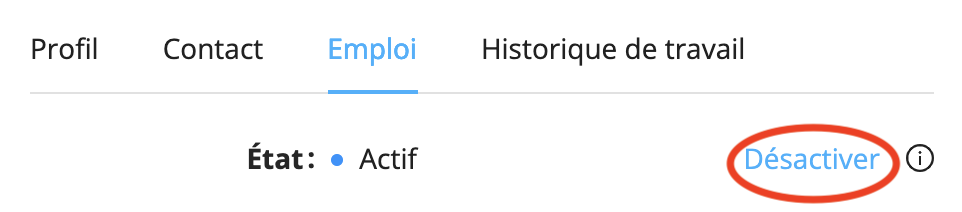
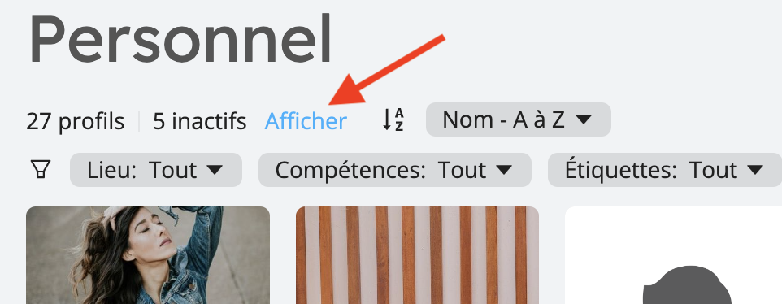
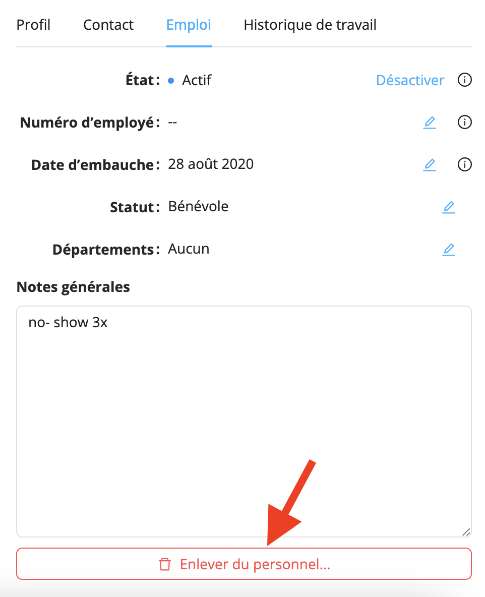

# Retirer le personnel de votre base de données

Pour une raison quelconque, si vous devez supprimer un membre du personnel de votre base de données, vous avez deux options. Ces options sont détaillées ci-dessous.

## Rendre un profil inactif

Rendre un profil inactif ne supprimera pas le profil de votre base de données mais le cachera essentiellement.

Les profils inactifs :

- n'apparaissent pas comme candidats ou suggestions pour les affectations
- ne reçoivent pas de notifications pour les nouvelles offres de travail
- sont masqués dans la liste principale de **Personnel**

C'est une solution pratique lorsque vos travailleurs sont temporairement licenciés, pour les travailleurs saisonniers, ou pour toute autre situation où il n'est pas pratique de garder un profil visible.

1. Ouvrez le profil du personnel que vous souhaitez supprimer dans la section **Personnel**.
2. Allez dans l'onglet **Emploi**.
3. Cliquez sur le lien **Désactiver**.

### Réactiver un profil inactif

Vous pouvez réactiver un profil inactif à tout moment. Pour trouver un profil inactif, utilisez l'outil Rechercher partout,
soit sélectionnez l'option **Afficher** les profils inactifs dans la section principale **Personnel** :

Une fois que vous avez trouvé le profil à réactiver :

1. Ouvrez le profil du personnel que vous souhaitez réactiver.
2. Allez dans l'onglet **Emploi**.
3. Cliquez sur le lien **Réactiver**.

## Supprimer complètement un profil

Si vous souhaitez supprimer complètement un profil de votre base de données au lieu de le rendre inactif, procédez comme suit :

1. Ouvrez le profil du staff que vous souhaitez supprimer dans la section **Personnel**.
2. Allez dans l'onglet **Emploi**.
3. Faites défiler jusqu'en bas et cliquez sur **Suppression du personnel**.

Le profil lui-même sera supprimé de votre base de données, mais l'historique de l'activité du personnel (affectations, messages,
) sera conservé et rien d'autre que le profil ne sera supprimé.
