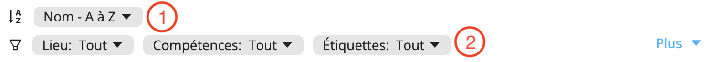

# Rechercher et filtrer votre personnel
Les informations que vous avez fournies pour chaque profil facilitent la recherche et le filtrage de votre personnel.

Lorsque vous recherchez des travailleurs dans la section **Personnel** et lorsque vous réservez du personnel, vous pouvez :
1. Sélectionner l'ordre dans lequel vous souhaitez voir apparaître les profils dans votre liste.
2. Utiliser une variété de filtres basés sur les informations spécifiques à chaque profil pour préciser votre recherche. Vous pouvez accéder à des filtres supplémentaires en cliquant sur **Plus**.

