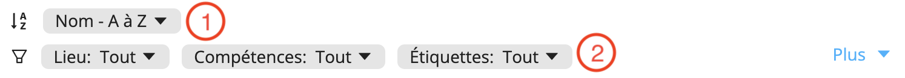
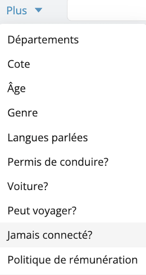
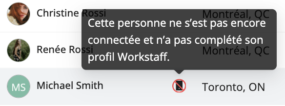

# Rechercher et filtrer votre personnel
Les informations que vous avez fournies pour chaque profil facilitent la recherche et le filtrage de votre personnel.

Lorsque vous recherchez des travailleurs dans la section **Personnel** et lorsque vous réservez du personnel, vous pouvez :
1. Sélectionner l'ordre dans lequel vous souhaitez voir apparaître les profils dans votre liste.
2. Utiliser une variété de filtres basés sur les informations spécifiques à chaque profil pour préciser votre recherche. Vous pouvez accéder à des filtres supplémentaires en cliquant sur **Plus**.

## Identifier les employés qui ne se sont pas encore connectés

Après avoir ajouté de nouveaux employés à votre compte, vous pouvez vouloir vérifier quels profils ne se sont pas encore connectés à l’application. Cela est particulièrement utile pour vous assurer que tout le monde a bien activé son compte et est prêt à recevoir des quarts de travail.

Vous pouvez facilement filtrer votre liste d’employés afin d’afficher uniquement ceux qui ne se sont jamais connectés :

- Rendez-vous dans votre **Liste d’employés**
- Ouvrez les options **+ Plus**
- Sélectionnez **Jamais connecté ?**

Cela affichera uniquement les profils qui ne se sont pas encore connectés à l’application.

:::note
Si vous voyez une **icône de téléphone avec une barre oblique** à côté du nom d’un employé, cela signifie qu’il ne s’est jamais connecté à l’application.
:::