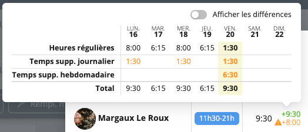

# Heures supplémentaires

Workstaff peut calculer et [rémunérer](../payroll/overtime.md) les heures supplémentaires automatiquement, à la fois quotidiennement et hebdomadairement.

## Indicateurs d'avertissement

Lorsque les [règles relatives aux heures supplémentaires](../customize/overtime.md) sont configurées dans votre compte, Workstaff affiche des avertissements aux endroits appropriés, tels que l'affichage du calendrier hebdomadaire ou lors de l'affectation de personnel. 
Ces avertissements sont conçus pour mettre en évidence les situations dans lesquelles des heures supplémentaires non désirées seraient introduites par une affectation.

### Dans le calendrier hebdomadaire

Dans la vue du calendrier hebdomadaire, un petit avertissement s'affiche pour tout membre du personnel avec des heures supplémentaires planifiées pour la semaine en cours :

### Lors de la réservation du personnel

Lors de l'affectation de personnel à l'aide du bouton **Affecter du personnel** sur les pages de projet, Workstaff fournit des avertissements si les affectations dépassent les limites d'heures supplémentaires. Survolez l'avertissement pour afficher les détails des heures supplémentaires. En outre, vous pouvez cliquer sur **Afficher les différences** pour voir les changements apportés par la ou les affectations en cours.

## Comment les heures supplémentaires sont-elles calculées ?

Les heures supplémentaires sont toujours calculées sur la base de semaines de travail complètes. Ces semaines de travail correspondent toujours au **premier jour de la semaine** configuré dans les paramètres généraux de votre compte.

Pour calculer les heures supplémentaires, Workstaff prend en compte toutes les périodes de travail effectuées par un membre du personnel au cours d'une semaine, et applique les règles relatives aux heures supplémentaires configurées sur votre compte. 
Les règles relatives aux **heures supplémentaires journalières** sont appliquées en premier, puis les **règles hebdomadaires**. 
Les règles hebdomadaires sont toujours appliquées sur la base des heures non supplémentaires calculées quotidiennement.

Si votre entreprise utilise le [moyennage des heures supplémentaires](../customize/overtime.md#période-de-moyennage), les heures supplémentaires sont calculées en fonction du nombre moyen d’heures travaillées par semaine sur la période sélectionnée — soit 2 ou 4 semaines.
Cela garantit que les heures supplémentaires ne sont générées que lorsque la moyenne hebdomadaire totale dépasse le seuil défini sur l’ensemble du cycle de moyennage.

Ces calculs étant assez compliqués et il est plus facile de les comprendre à l'aide d'exemples :

### Exemples avec des règles journalières

Workstaff applique les règles journalières indépendamment pour chaque jour travaillé.

**Règle journalière unique avec une limite de 8 heures par jour**

|                             | LUN | MAR | MER | JEU | VEN  | SAM | DIM |
|-----------------------------|-----|-----|-----|-----|------|-----|-----|
| Heures travaillées          | 7h  | 8h  | 9h  | 9h  | 7.5h |     |     |
| Heures régulières           | 7h  | 8h  | 8h  | 8h  | 7.5h |     |     |
| Temps suppl. journalier @8h |     |     | 1h  | 1h  |      |     |     |     

**Deux règles journalières avec une limite à 8 heures et 12 heures par jour**

|                              | LUN | MAR | MER | JEU | VEN | SAM | DIM |
|------------------------------|-----|-----|-----|-----|-----|-----|-----|
| Heures travaillées           | 7   | 8   | 13  | 7.5 | 12  |     |     |
| Heures régulières            | 7   | 8   | 8   | 7.5 | 8   |     |     |
| Temps suppl. journalier @8h  |     |     | 4   |     | 4   |     |     |     
| Temps suppl. journalier @12h |     |     | 1   |     |     |     |     |

### Exemples de règles hebdomadaires

Workstaff applique des règles hebdomadaires basées sur la somme cumulée des heures travaillées au cours de la semaine.

**Règle hebdomadaire unique avec une limite de 35 heures par semaine**

|                         | LUN | MAR  | MER  | JEU  | VEN | SAM | DIM |
|-------------------------|-----|------|------|------|-----|-----|-----|
| Heures travaillées      | 8.5 | 8    | 9    | 9    | 7.5 |     |     |
| 👉 Cumulatif            | 8.5 | 16.5 | 25.5 | 34.5 | 42  |     |     |
| Heures régulières       | 8.5 | 8    | 9    | 9    | 0.5 |     |     |
| Temps suppl. hebdo @35h |     |      |      |      | 7   |     |     |     

**Deux règles hebdomadaires avec des limites à 35 heures et 40 heures par semaine**

|                         | LUN | MAR  | MER  | JEU  | VEN | SAM | DIM |
|-------------------------|-----|------|------|------|-----|-----|-----|
| Heures travaillées      | 8.5 | 8    | 9    | 9    | 7.5 | 8   |     |
| 👉 Cumulatif            | 8.5 | 16.5 | 25.5 | 34.5 | 42  | 50  |     |
| Heures régulières       | 8.5 | 8    | 9    | 9    | 0.5 |     |     |
| Temps suppl. hebdo @35h |     |      |      |      | 5   |     |     |     
| Temps suppl. hebdo @40h |     |      |      |      | 2   | 8   |     |     

### Exemple avec des règles journalières et hebdomadaires

Lorsque des règles quotidiennes et hebdomadaires sont présentes, Workstaff applique d'abord les règles journalières, puis les règles hebdomadaires sur le cumul des heures normales.

**Règle journalière combinée avec une limite de 8 heures et règle hebdomadaire avec une limite de 35 heures par semaine.

|                             | LUN | MAR | MER | JEU | VEN | SAM | DIM |
|-----------------------------|-----|-----|-----|-----|-----|-----|-----|
| Heures travaillées          | 9   | 8   | 10  | 9   | 9   | 6   |     |
| 👉 Cumulatif                | 9   | 17  | 27  | 36  | 45  | 51  |     |
| Heures régulières           | 8   | 8   | 8   | 8   | 3   | 0   |     |
| 👉 Cumulatif                | 8   | 16  | 24  | 32  | 35  | 35  |     |     
| Temps suppl. journalier @8h | 1   |     | 2   | 1   | 1   |     |     |     
| Temps suppl. hebdo @35h     |     |     |     |     | 5   | 6   |     |     

### Exemple avec moyennage des heures supplémentaires

Workstaff applique les règles hebdomadaires en fonction du total cumulé des heures travaillées au cours de la période de moyennage configurée.

**Règle hebdomadaire unique avec une limite de 40 heures par semaine, avec moyennage sur deux semaines activé (soit un total de 80 h sur la période)**

**Semaine 1 :**

|                               | LUN | MAR  | MER | JEU | VEN | SAM | DIM |
|-------------------------------|-----|------|-----|-----|-----|-----|-----|
| Heures travaillées            | 8   | 8    | 8   | 7   | 12  |     |     |
| 👉 Cumulatif (sur 2 semaines) | 8   | 16   | 24  | 31  | 43  |     |     |
| Temps suppl. sur 2 sem. @80h  |     |      |     |     |     |     |     | 

**Semaine 2 :**

|                               | LUN | MAR | MER | JEU | VEN | SAM | DIM |
|-------------------------------|-----|-----|-----|-----|-----|-----|-----|
| Heures travaillées            | 5   | 8   | 5   | 8   | 12  |     |     |
| 👉 Cumulatif (sur 2 semaines) | 48  | 56  | 61  | 69  | 81  |     |     |
| Temps suppl. sur 2 sem. @80h  |     |     |     |     | 1   |     |     | 

Comme la **règle d’heures supplémentaires** est fixée à **40 heures par semaine** et que le **moyennage sur deux semaines** est activé, les heures supplémentaires sont calculées **uniquement si le total d’heures travaillées dépasse 80 heures** sur la période de deux semaines.  

Dans cet exemple, même si le personnel a travaillé 43 heures la première semaine, la limite hebdomadaire ne s’applique pas — puisque le moyennage est activé, le seuil à considérer est de 80 heures pour les deux semaines, et non de 40 heures par semaine.  
Ici, l’employé a travaillé un total de **81 heures**, donc **1 heure supplémentaire** est générée **le dernier jour de la deuxième semaine**.  

## Rémunération des heures supplémentaires

C'est le module Paie qui calcule [la rémunération précise des heures supplémentaires](../payroll/overtime.md). Assurez-vous que votre plan inclut cette fonctionnalité si vous souhaitez rémunérer les heures supplémentaires.
