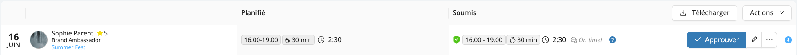
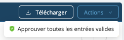

# Soumission et approbation des heures

Une fois que vos employés ont pointé au début et à la fin d'un quart, ils sont invités à soumettre leurs feuilles de temps à partir de leur téléphone portable. Workstaff facilite le suivi des soumissions de temps de votre personnel.

<iframe width="640" height="307" src="https://www.loom.com/embed/f769ca8c89e24901991ba0b5267d53b9" frameborder="0" webkitallowfullscreen mozallowfullscreen allowfullscreen></iframe>

## Feuilles de temps
Vous pouvez facilement visualiser les feuilles de temps soumises par votre personnel en allant dans la section **Suivi du temps** du menu principal.
Cette section vous permet de filtrer les feuilles de temps de la manière suivante :
- **Tout** : affiche toutes les feuilles de temps à venir, en attente et approuvées.
- **En attente de saisie** : affiche uniquement les feuilles de temps que votre personnel n'a pas encore soumises.
- **À approuver** : affiche toutes les feuilles de temps soumises par votre personnel.

### Vérifications

Pour chaque feuille de temps, la section **Suivi du temps** vous affiche le temps planifié et le temps soumis.
Si les informations ne correspondent pas, Workstaff vous montrera directement sur la feuille de temps quelles sont les données incorrectes afin que vous puissiez les vérifier, et si nécessaire, communiquer avec votre personnel.

Les vérifications sont les suivantes :
- **Passé**: si le temps soumis correspond au temps planifié et que les données relatives au pointage des heures sont correctes, l’icône de vérification est verte.

- **Échoué**: si le temps soumis ne correspond pas au temps planifié et que les données relatives au pointage des heures sont incorrectes, l’icône de vérification est rouge. Passez votre curseur sur l’icône afin d’afficher le détail des vérifications. Workstaff vous indiquera si le pointage a été fait à l’heure et à quelle distance du site de travail.

Vous avez la possibilité de modifier une feuille de temps si les informations qu'elle contient sont incorrectes ou si le personnel a oublié de pointer ses heures en cliquant sur l'icône de crayon à droite de la feuille de temps. 

### Approuver les feuilles de temps valides
Les feuilles de temps valides peuvent être approuvées en une seule fois en sélectionnant **Approuver toutes les entrées valides** dans le menu d'action.

### Télécharger des feuilles de temps 
Vous pouvez exporter des rapports Excel à partir des feuilles de temps pour des périodes précises en sélectionnant les dates et en cliquant sur **Télécharger**. 

## En savoir plus
Visitez la page [**Soumettre vos heures**](../../workers/manage-your-time/report-your-time.md) de notre Centre d’aide **pour les travailleurs** afin d’en savoir plus et de partager ces informations avec votre personnel. 
