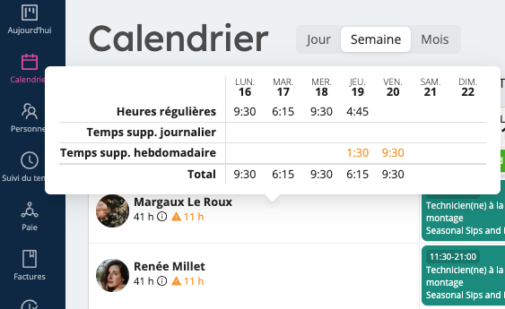
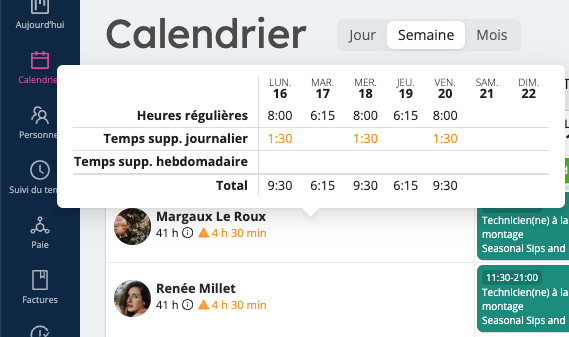

# Heures supplémentaires
En fonction des règles relatives aux heures supplémentaires que vous avez sélectionnées dans l'onglet **Compte** de la section **Paramètres**, Workstaff vous avertit de toute heure supplémentaire effectuée par votre personnel.

## Avertissements visuels et suivi
Lorsque les employés dépassent les limites de temps journalières et/ou hebdomadaires, Workstaff affiche des avertissements sur le calendrier hebdomadaire. Ces avertissements sont accompagnés du nombre total d'heures travaillées au cours de la semaine. Analysons les différents scénarios :

- **Heures supplémentaires hebdomadaires**   
  Par exemple, si la limite hebdomadaire est fixée à 30 heures, toutes les heures travaillées au-delà de cette limite sont mises en évidence dans le calendrier hebdomadaire sous le nom du travailleur concerné. En passant la souris sur le signe d'avertissement, vous obtiendrez des informations détaillées sur les heures supplémentaires.  
  

- **Heures supplémentaires quotidiennes**  
  De même, si la limite quotidienne est de 8 heures, Workstaff affiche toutes les heures supplémentaires travaillées sur le calendrier quotidien lorsque cette limite est dépassée.  
  

- **Heures supplémentaires journalières et hebdomadaires combinées**   
  Lorsque les règles relatives aux heures supplémentaires hebdomadaires et journalières sont définies, les heures supplémentaires hebdomadaires sont calculées à partir des heures normales, une fois que les heures supplémentaires journalières ont été prises en compte.  
  [Heures supplémentaires combinées](Images/Supp-Combiné.png)

### Réservation de personnel avec alertes sur les heures supplémentaires
Lors de la réservation de personnel à l'aide du bouton **Affecter du personnel** sur les pages de projet, Workstaff fournit des avertissements si les affectations dépassent les limites d'heures supplémentaires. Survolez l'avertissement pour afficher les détails des heures supplémentaires. De plus, vous pouvez cliquer sur **Afficher les différences** pour voir les changements apportés par la ou les réservations en cours.  
[Affectation avec heures supplémentaires](Images/Supp-booking.png)

