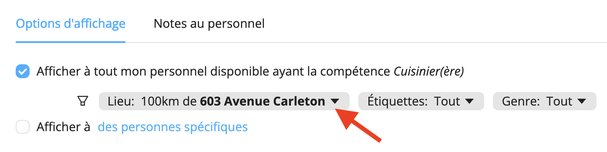
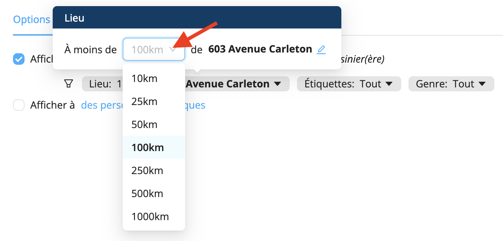

# Le personnel ne peut pas voir les offres de travail

## Aucune compétence associée au profil
Dans certains cas que nous avons observés, des membres du personnel n’étaient pas en mesure de voir les offres de travail car aucune compétence n’avait été ajoutée à leur profil. Assurez-vous d’ajouter des compétences au profil de votre personnel afin qu’il puisse voir les offres correspondant à ces compétences.

## Distance trop importante entre la ville de résidence et le lieu de l'événement
Il arrive parfois que votre personnel ne puisse pas voir les offres dans l'onglet **Opportunités** de l’appli mobile. Dans la plupart des cas que nous avons observés, cela était dû au fait que la distance entre le lieu de travail et le lieu enregistré dans le profil du travailleur était trop importante. Par défaut, une offre de travail est affichée pour les employés situés à 100 km ou moins du lieu de travail.

Ce problème est généralement résolu lorsque vous modifiez la distance d’affichage du poste.
1. Allez dans l’onglet Affichage de votre projet
2. Cliquez sur le bouton **Lieu**

3. Choisissez la distance d’affichage de l’offre

  

Ce problème peut aussi être résolu en demandant au personnel de modifier la ville de résidence dans leur profil pour une ville plus proche de votre lieu d’opérations.

Visitez la page [**Je ne peux pas voir les offres de travail**](https://help.workstaff.app/fr/docs/workers/troubleshooting/cannot-see-offers/) de notre **Centre d’aide** pour les travailleurs afin d’en savoir plus et de partager ces informations avec votre personnel. 
