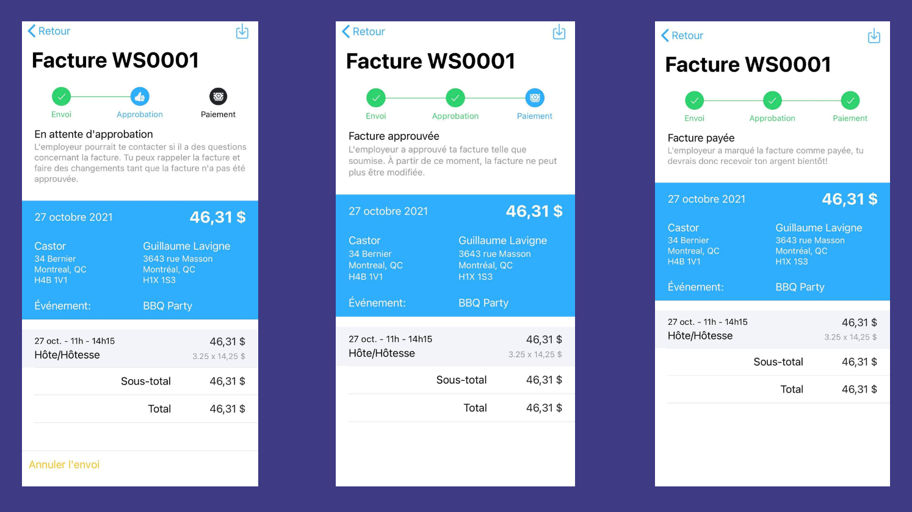

# Créez des factures pour votre travail

:::important Les factures sont pour les travailleurs autonomes / pigistes
Workstaff vous proposera de facturer vos heures travaillées que si votre employeur a déclaré votre statut de travailleur autonome / pigiste.
:::

Une fois que vous avez soumis vos heures, et que ces heures ont été approuvées, Workstaff vous permet de créer et d'envoyer des factures à votre employeur rapidement et sans effort.

## Accéder à vos factures

Tous les outils nécessaires à la gestion de vos factures se trouvent dans la section **Facturation**. Vous pouvez accéder à cette section de plusieurs façons :

- Dans l'onglet **Aujourd'hui**, si un quart passé peut être facturé, une option **Envoyer votre facture pour le(s) quart(s) terminé(s)** s'affichera sous **Choses à faire**.
- Dans l'onglet **Profil**, ouvrez la section **Facturation**.

## Avant de commencer

Vous devrez fournir quelques informations relatives à la facturation avant de pouvoir utiliser la page **Facturation**. Suivez les instructions affichées à l'écran pour vous configurer pour la facturation.

## Quand les quarts de travail peuvent-ils être facturés?

Seuls les quarts de travail répondant aux critères suivants peuvent être facturés :

- Le quart doit avoir été effectué.
- Le quart doit être rémunéré (il doit y avoir des gains).
- Une saisie des temps doit avoir été [soumise et approuvée](./manage-your-time/report-your-time.md)
- Votre employeur doit avoir déclaré votre statut de travailleur autonome.

Si certains de vos quarts de travail n'apparaissent pas dans la section **Facturation** alors que vous pensez qu'ils le devraient, veuillez prendre contact avec votre employeur et vous assurer que les conditions ci-dessus sont toutes remplies.

## Remplir et envoyer une facture

Une fois que vous avez effectué un quart de travail facturable, ce quart de travail, ainsi que tout autre quart de travail que vous avez effectué et qui peut également être facturé, sera listé tout en haut de la section de facturation.

1. Tapez sur le bouton **+ FACTURER** à côté de l'horaire pour créer une facture en mode **Brouillon**
2. Vérifiez et/ou modifiez les informations de la facture. Vous pouvez toucher n'importe quelle ligne pour la modifier
3. Vous pouvez également **Ajouter une ligne** pour ajouter toute ligne personnalisée non couverte par Workstaff
4. Appuyez sur **Envoyer** lorsque les informations sont correctes et que vous êtes prêt à soumettre votre facture.

:::tip Conseil de pro
Si vous avez travaillé sur plusieurs quarts de travail dans le même horaire, ils seront consolidés dans différentes lignes de la même facture. Si vous avez effectué plusieurs quarts de travail pour le même événement ou le même horaire, nous vous suggérons fortement **d'attendre d'avoir terminé tous les quarts avant de les facturer**.
:::

## Modifier / Rappeler une facture soumise

Si vous avez soumis une facture, mais que vous devez la corriger, ou si votre employeur a demandé des corrections après que vous avez soumis une facture, vous devez la rappeler :

1. Appuyez sur **Annuler l'envoi** au bas de l'écran de la facture
2. La facture revient en mode **Brouillon** et vous pouvez la modifier selon vos besoins
3. Une fois vos modifications terminées, vous pouvez à nouveau **Envoyer**

:::note
Seules les factures qui n'ont pas encore été approuvées par votre employeur peuvent être rappelées. Une fois rappelée, une facture ne peut pas être supprimée et doit être annulée.
:::

## Processus de facturation
Une fois que votre facture a été soumise, vous pourrez consulter son état d'avancement, y compris la date à laquelle elle est **approuvée** et programmée pour être **payée**.

