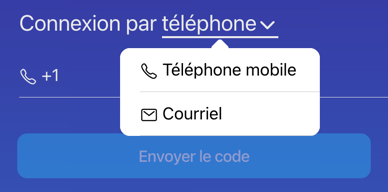

:::caution Workstaff est offert sur invitation seulement.
Il n'est pas possible de s'inscrire soi-même à Workstaff pour le moment. Pour vous connecter à Workstaff, vous devez d'abord avoir
été invité.e par un employeur qui utilise l'app pour gérer son personnel.
:::

# Je n'arrive pas à me connecter à Workstaff

Il peut arriver que vous éprouviez des difficultés à vous connecter à l'app mobile. Dans la plupart des cas, nous avons observé que cela est généralement dû aux raisons énumérées ci-dessous :

- Votre employeur n'a pas encore créé de compte pour vous.
- Vos coordonnées ne sont peut-être pas correctes dans le profil créé par votre employeur.
- Les informations de contact que vous avez saisies lors de la connexion ne correspondent peut-être pas à celles que votre employeur a utilisées pour créer votre compte.

## Solutions possibles

Lorsque vous saisissez vos informations de contact pour vous connecter, veillez à les taper vous-même plutôt que de les copier et de les coller.

Si vous ne parvenez pas à vous connecter, contactez votre employeur pour vous assurer qu'il a créé un profil pour vous et que vos coordonnées sont correctes.

## Je n'ai pas de numéro de téléphone mobile ou mon téléphone n'est pas nord-américain

Workstaff permet aux travailleurs de se connecter à l'app mobile sans mot de passe, par l'entremise d'un code de sécurité de 6 chiffres envoyé par message texte à un numéro de téléphone nord-américain (débutant par `+1`). Ce code combiné à votre numéro de téléphone sert à valider que vous êtes bien la personne que votre employeur a invitée.

Si vous avez un téléphone provenant d'un autre plan de numérotation que le plan de numérotation nord-américain, ou si vous n'avez pas accès à un téléphone qui peut recevoir des messages textes, assurez-vous de communiquer à votre employeur votre adresse courriel. Vous pourrez alors choisir la **connexion par courriel** en utilisant le menu déroulant sur la page de connexion:

## Je ne reçois pas le code de connexion

Lorsque Workstaff vous envoie le code de connexion par courriel ou message texte, soyez patient. Il peut arriver qu'il y ait de délais dans la réception du message texte ou courriel. Il ne sert à rien de vous renvoyer un code après seulement quelques secondes.

:::info
Le code de connexion ne peut être utilisé qu'une seule fois et n'est valide que pour une durée de temps limité. Si vous vous renvoyez un nouveau code, le code précédemment envoyé ne sera plus valide. Assurez-vous donc de toujours utiliser le code de connexion le plus récent. 
:::

