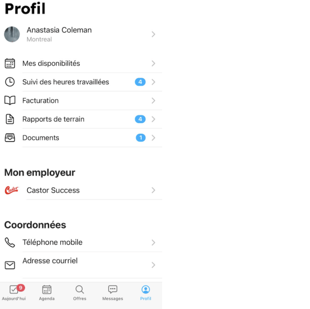

# Mettre à jour mes informations personnelles

## Mon adresse courriel ou mon numéro de téléphone a changé

Pour mettre à jour votre adresse courriel ou votre numéro de téléphone, allez dans la section **Coordonnées** de votre profil.

Cliquez sur **Téléphone mobile** pour entrer votre nouveau numéro — Workstaff vous enverra un code de vérification par SMS.
Pour votre adresse courriel, appuyez sur **Adresse courriel**, entrez votre nouvelle adresse et confirmez le changement via le courriel de vérification que Workstaff vous enverra.

Une fois vos informations vérifiées, vous pourrez les utiliser pour [**vous connecter**](../getting-started.md#se-connecter)

:::note
Workstaff prend désormais en charge la vérification des numéros de téléphone non nord-américains. Cependant, veuillez noter qu’il n’est toujours pas possible d’utiliser un numéro non nord-américain pour se connecter.
Pour plus de détails, consultez l’article [**Je n'ai pas de numéro de téléphone mobile ou mon téléphone n'est pas nord-américain**](./login.md#je-nai-pas-de-numéro-de-téléphone-mobile-ou-mon-téléphone-nest-pas-nord-américain).
:::

:::tip
Si vous avez changé de numéro de téléphone, vous pouvez toujours vous connecter avec votre adresse courriel, et inversement.
Une fois connecté.e, vous pourrez mettre à jour vos coordonnées depuis votre profil.
:::

## Mon lieu de travail a changé

### J’ai déménagé dans une autre ville

Pour mettre à jour votre ville de résidence, rendez-vous dans l’onglet **Profil** de votre application mobile et cliquez sur votre nom sous **Profil**. 
Ensuite, sélectionnez **Informations de base** et modifiez votre **Ville de résidence**.

### Je travaille dans deux lieux différents

Si vous partagez votre temps entre deux régions et que vous êtes disponible pour travailler dans les deux, vous pouvez ajouter un deuxième lieu de travail.
Rendez-vous dans l’onglet **Profil** de votre application mobile, cliquez sur votre nom sous **Profil**, puis sélectionnez **Lieux de travail** et ajoutez une **Région secondaire**.

:::info
Si vous ajoutez un deuxième lieu de travail, Workstaff vous proposera alors des opportunités de travail de la part de votre ou vos employeurs dans les deux régions.
:::

